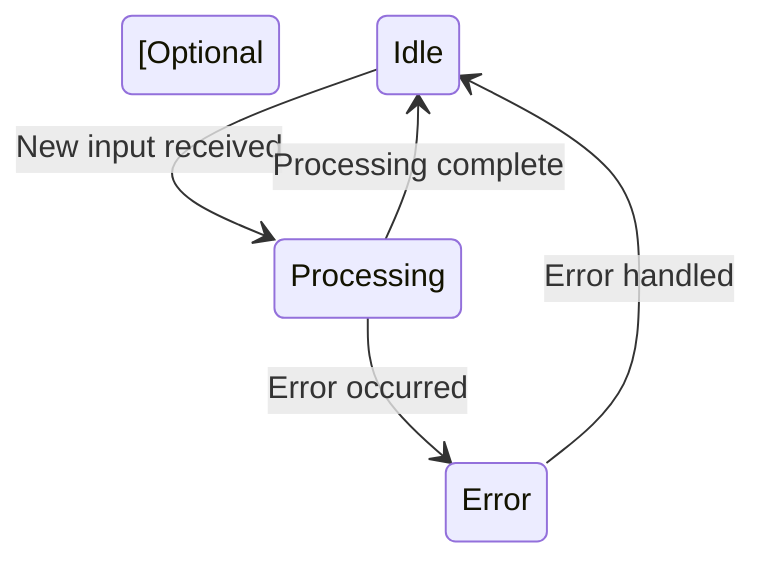

# Component Specification Template

## Revision History

| Version | Date       | Author | Changes                              |
|---------|------------|--------|--------------------------------------|
| 0.1     | YYYY-MM-DD | [Name] | Initial draft                        |

## Component Name

[Brief name of the component]

## Purpose

[A concise statement of the component's purpose and role in the system]

## Responsibilities

[Bullet list of the component's core responsibilities]

- Responsibility 1
- Responsibility 2
- Responsibility 3

## Interfaces

### Inputs

[Description of the data and control inputs to this component]

| Input | Type | Description | Source |
|-------|------|-------------|--------|
| Input 1 | [Data type] | [Description] | [Source component] |
| Input 2 | [Data type] | [Description] | [Source component] |

### Outputs

[Description of the data and control outputs from this component]

| Output | Type | Description | Destination |
|--------|------|-------------|-------------|
| Output 1 | [Data type] | [Description] | [Destination component] |
| Output 2 | [Data type] | [Description] | [Destination component] |

## Behavior

[Description of how the component behaves, including any state transitions, algorithms, or processing logic]

## Design Decisions

[Key design decisions for this component, with rationale]

1. **Decision 1**: [Description]
   - Rationale: [Why this decision was made]
   - Alternatives considered: [What other options were considered]

2. **Decision 2**: [Description]
   - Rationale: [Why this decision was made]
   - Alternatives considered: [What other options were considered]

## Implementation Considerations

[Guidance for implementing this component]

### Technologies

[Suggested technologies, libraries, or frameworks]

### Algorithms

[Key algorithms or processing approaches]

### Error Handling

[How errors should be handled by this component]

### Performance Considerations

[Performance considerations specific to this component]

## Testing Approach

[Guidance on how to test this component]

### Unit Testing

[Approach to unit testing]

### Integration Testing

[Approach to integration testing]

## Dependencies

[Dependencies on other components or external systems]

| Dependency | Type | Purpose |
|------------|------|---------|
| Dependency 1 | [Internal/External] | [Why this dependency exists] |
| Dependency 2 | [Internal/External] | [Why this dependency exists] |

## Future Considerations

[Potential future enhancements or changes to this component]

---

**Note**: To use this template, copy this file, rename it to match your component (e.g., `reader-component.md`), and fill in the sections with component-specific information.