# ADR-0004: Package Structure

**Date:** 2025-05-07

**Status:** Proposed

## Context

The Knowledge Base Processor needs a clear package structure that reflects the component architecture described in the system documentation. As the project develops, we need to establish conventions for organizing code that align with our architectural principles and support the system's evolution.

Key considerations include:

- The system has several distinct components (Reader, Processor, Extractor, Analyzer, Enricher, Metadata Store, Query Interface) as defined in the system-overview/components.md document
- Cross-cutting concerns like configuration need to be addressed
- The structure should align with our architectural principles, particularly simplicity and maintainability
- No plugin system is required at this stage, but the structure should not preclude adding one in the future
- The package structure should facilitate clear separation between components while keeping the overall organization relatively flat

## Decision

We will adopt a relatively flat package structure that directly maps to the component architecture defined in our system documentation. Each major component will have its own top-level package, with cross-cutting concerns separated into dedicated packages.

The package structure will be organized as follows:

```
knowledgebase_processor/
├── __init__.py
├── models/
│   ├── __init__.py
│   ├── content.py
│   ├── metadata.py
│   └── common.py
├── reader/
│   ├── __init__.py
│   └── reader.py
├── processor/
│   ├── __init__.py
│   └── processor.py
├── extractor/
│   ├── __init__.py
│   ├── base.py
│   ├── frontmatter.py
│   └── tags.py
├── analyzer/
│   ├── __init__.py
│   ├── base.py
│   ├── topics.py
│   └── entities.py
├── enricher/
│   ├── __init__.py
│   ├── base.py
│   └── relationships.py
├── metadata_store/
│   ├── __init__.py
│   └── store.py
├── query_interface/
│   ├── __init__.py
│   └── query.py
├── config/
│   ├── __init__.py
│   └── config.py
├── utils/
│   ├── __init__.py
│   ├── logging.py
│   └── text.py
└── cli/
    ├── __init__.py
    └── main.py
```

This structure can be visualized as:

```mermaid
graph TD
    Root[knowledgebase_processor/]
    Root --> Models[models/]
    Root --> Reader[reader/]
    Root --> Processor[processor/]
    Root --> Extractor[extractor/]
    Root --> Analyzer[analyzer/]
    Root --> Enricher[enricher/]
    Root --> MetadataStore[metadata_store/]
    Root --> QueryInterface[query_interface/]
    Root --> Config[config/]
    Root --> Utils[utils/]
    Root --> CLI[cli/]
    
    Models --> ContentModels[content.py]
    Models --> MetadataModels[metadata.py]
    Models --> CommonModels[common.py]
    
    Reader --> ReaderImpl[reader.py]
    
    Processor --> ProcessorImpl[processor.py]
    
    Extractor --> ExtractorBase[base.py]
    Extractor --> FrontmatterExtractor[frontmatter.py]
    Extractor --> TagExtractor[tags.py]
    
    Analyzer --> AnalyzerBase[base.py]
    Analyzer --> TopicAnalyzer[topics.py]
    Analyzer --> EntityAnalyzer[entities.py]
    
    Enricher --> EnricherBase[base.py]
    Enricher --> RelationshipEnricher[relationships.py]
    
    MetadataStore --> StoreImpl[store.py]
    
    QueryInterface --> QueryImpl[query.py]
    
    Config --> ConfigImpl[config.py]
    
    Utils --> LoggingUtils[logging.py]
    Utils --> TextUtils[text.py]
    
    CLI --> CLIImpl[main.py]
```



## Rationale

This package structure was chosen for several reasons:

1. **Direct Mapping to Architecture**: The structure directly reflects the component architecture defined in our system documentation, making it easy to understand and navigate. Each major component has its own dedicated package.

2. **Flat Structure**: The relatively flat hierarchy aligns with our simplicity principle, avoiding unnecessary nesting that could make the codebase harder to navigate.

3. **Clear Component Boundaries**: Each component has its own package, enforcing separation of concerns and making dependencies between components explicit.

4. **Centralized Models**: Placing all data models in a central `models` package makes them easily accessible to all components and ensures consistency.

5. **Separated Cross-cutting Concerns**: Configuration and utilities are separated into their own packages, preventing them from being scattered throughout the codebase.

6. **Future Extensibility**: While we're not implementing a plugin system now, the structure allows for future extension by adding plugin support within each component package.

7. **Maintainability**: The clear separation makes it easier to maintain and modify individual components without affecting others.

## Alternatives Considered

### 1. Deeply Nested Structure

```
knowledgebase_processor/
├── core/
│   ├── models/
│   ├── config/
│   └── utils/
├── components/
│   ├── reader/
│   │   ├── impl/
│   │   └── utils/
│   ├── processor/
│   │   └── impl/
│   ├── extractor/
│   │   ├── impl/
│   │   ├── frontmatter/
│   │   └── tags/
│   └── ...
└── cli/
```

- **Pros**: More granular organization, clearer subcomponent boundaries
- **Cons**: More complex imports, harder to navigate, potential for over-engineering
- **Reason not chosen**: Conflicts with our simplicity principle for a personal-use system and introduces unnecessary complexity

### 2. Feature-based Structure

```
knowledgebase_processor/
├── frontmatter/
│   ├── extractor.py
│   ├── models.py
│   └── analyzer.py
├── tags/
│   ├── extractor.py
│   ├── models.py
│   └── analyzer.py
└── ...
```

- **Pros**: Groups related functionality across component boundaries
- **Cons**: Doesn't align with the component architecture, harder to enforce boundaries
- **Reason not chosen**: Doesn't reflect the system's component-based design and would make it harder to maintain clear component boundaries

### 3. Single Module Structure

```
knowledgebase_processor/
├── __init__.py
├── reader.py
├── processor.py
├── extractor.py
├── analyzer.py
└── ...
```

- **Pros**: Ultimate simplicity, no package navigation needed
- **Cons**: Poor separation of concerns, harder to maintain as system grows
- **Reason not chosen**: Insufficient separation of components, would become unwieldy as the codebase grows

## Consequences

### Positive

- Clear mapping between architecture and code structure
- Easy to understand where specific functionality belongs
- Simpler imports and references between components
- Easier onboarding for future contributors
- Supports the principle of simplicity while maintaining clear component boundaries
- Provides a foundation that can evolve with the system

### Negative

- May require refactoring if more complex plugin systems are needed later
- Some cross-component functionality might be harder to organize
- Could lead to circular dependencies if not carefully managed

## Implementation Guidelines

To effectively implement this package structure, we will follow these guidelines:

1. **Public APIs**: Each component package should have a clear public API, typically defined in its `__init__.py` file.

2. **Information Hiding**: Internal implementation details should be hidden when possible, exposing only what's necessary for other components.

3. **Cross-cutting Concerns**: Configuration and utilities should be centralized in their respective packages and accessed consistently throughout the codebase.

4. **Models**: Data models should be defined in the `models` package and imported by components that need them.

5. **Imports**: Prefer absolute imports over relative imports for clarity.

6. **Circular Dependencies**: Avoid circular dependencies between packages by carefully managing the direction of dependencies.

7. **Package Documentation**: Each package should include documentation explaining its purpose and responsibilities.

## Related Decisions

This decision builds on:
- [ADR-0001: Python as Implementation Language](0001-python-as-implementation-language.md)
- [ADR-0002: Pydantic for Data Models](0002-pydantic-for-data-models.md)

This decision will influence:
- Code organization and file structure
- Import patterns and dependencies
- Future extensibility mechanisms

## Notes

- This structure is intended to evolve with the system. As new requirements emerge, we may need to revisit and refine it.
- While we're not implementing a plugin system now, the structure should be reviewed if plugin capabilities are added in the future.
- The structure aligns with Python's packaging conventions and best practices.