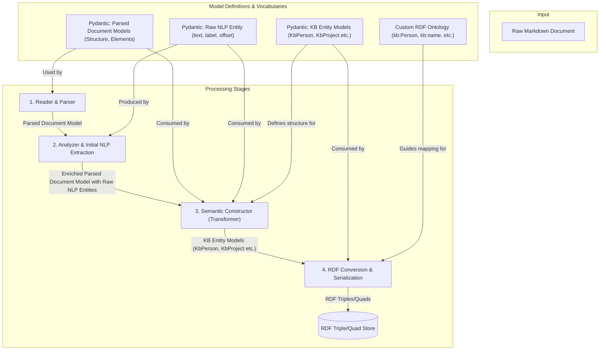

# ADR-0010: Entity Modeling and Transformation for RDF Serialization

**Date:** 2025-05-20

**Status:** Accepted

## Context

With the adoption of an RDF-based knowledge graph ([ADR-0009](0009-knowledge-graph-rdf-store.md)), a clear strategy is needed for how raw document content and extracted information are transformed into structured entities suitable for RDF serialization. This involves defining how different types of "models" and "entities" are conceptualized and processed throughout the pipeline, from initial parsing to final RDF representation. Key considerations include leveraging Pydantic for data modeling ([ADR-0002](0002-pydantic-for-data-models.md)) and ensuring a clear pathway for semantic enrichment.

## Decision

We will adopt a multi-stage processing pipeline that explicitly distinguishes between document-centric models, raw NLP-extracted entities, and semantically rich Knowledge Base (KB) Entity Models. These KB Entity Models will be the direct input for RDF serialization.

**Terminology:**

*   **Parsed Document Model**: Pydantic models representing the source document's structure, content, and explicit metadata (e.g., `Document`, `Section`, `HeadingElement`).
*   **Raw NLP Entity**: Pydantic models (e.g., `ExtractedEntity`) representing text spans identified by NLP with generic labels (e.g., PERSON, ORG) and character offsets, linked to the Parsed Document Model.
*   **Knowledge Base (KB) Entity Model / Semantic Entity Model**: Specific Pydantic models (e.g., `KbPerson`, `KbProject`) representing conceptual entities and their attributes, designed for direct mapping to the RDF knowledge graph.
*   **Ontologies/Vocabularies**: RDF schemas defining types and relationships in the target knowledge graph.

**Pipeline Stages:**

1.  **Stage 1: Document Ingestion & Structural Parsing**:
    *   The `Reader & Parser` ingests source files, producing a **Parsed Document Model**.
2.  **Stage 2: Document-Level Analysis & Initial NLP Extraction**:
    *   The `Analyzer` enriches the Parsed Document Model.
    *   An NLP process within the `Extractor` identifies **Raw NLP Entities** from the text in the Parsed Document Model.
3.  **Stage 3: Semantic Construction - Transformation to KB Entity Models**:
    *   A "Semantic Constructor" (logical part of the `Extractor`) transforms information from the enriched Parsed Document Model and Raw NLP Entities into instances of specific **KB Entity Models**. This involves rules, contextual analysis, and mapping logic.
    *   Initial KB Entity Models (e.g., `KbPerson`, `KbProject`, `KbTodoItem`, `KbMeeting`) will be defined as Pydantic classes.
4.  **Stage 4: RDF Serialization**:
    *   The `RDF Conversion & Serialization` component maps the KB Entity Model instances to RDF triples/quads based on a defined (initially custom, then potentially standard) RDF ontology.

## Rationale

This approach provides:

*   **Clarity**: Explicitly defines different stages of data representation, reducing ambiguity.
*   **Modularity**: Each stage has clear inputs and outputs, facilitating development and testing.
    *   The `Reader & Parser` focuses on document structure.
    *   The `Analyzer` and initial NLP extraction focus on document-level insights and raw entity spotting.
    *   The "Semantic Constructor" handles the complex task of transforming diverse inputs into canonical KB entity representations.
    *   The `RDF Converter` focuses on mapping these canonical KB entities to RDF.
*   **Flexibility & Extensibility**:
    *   New KB Entity types can be added by defining new Pydantic models and updating the Semantic Constructor and RDF mapping rules.
    *   The ontology can evolve, and mappings can be adjusted.
    *   The transformation logic in the Semantic Constructor can be incrementally improved.
*   **Strong Typing**: Leverages Pydantic for all intermediate data models, ensuring type safety and validation.
*   **Alignment with Existing Decisions**: Builds upon the use of Pydantic ([ADR-0002](0002-pydantic-for-data-models.md)) and the RDF knowledge graph architecture ([ADR-0009](0009-knowledge-graph-rdf-store.md)).

## Diagram

## Alternatives Considered

*   **Direct Mapping from Generic Entities**: Directly mapping `Raw NLP Entities` to RDF without a distinct KB Entity Model stage. This would place significant complexity on the RDF converter and offer less structured intermediate representation.
*   **Ontology-Driven Pydantic Models Only**: Defining Pydantic models that strictly mirror a pre-defined, comprehensive ontology from the outset. While a valid approach, it requires extensive upfront ontology work and might make the Pydantic models less idiomatic for Python processing before RDF conversion. The chosen hybrid approach allows for more iterative ontology development.

## Consequences

### Positive
*   Improved clarity in the data transformation pipeline.
*   Better separation of concerns between parsing, NLP extraction, semantic modeling, and RDF generation.
*   Enhanced maintainability and testability of individual components.
*   Provides a robust foundation for creating high-quality, structured RDF data.

### Negative
*   Introduces an additional conceptual layer (KB Entity Models) and transformation step (Semantic Constructor), which adds some complexity to the overall pipeline.
*   The "Semantic Constructor" logic will require careful design and implementation to correctly map diverse inputs to canonical KB entities.

### Neutral
*   Requires disciplined definition and management of Pydantic models for each stage.

## Related Decisions

*   [ADR-0002: Pydantic for Data Models](0002-pydantic-for-data-models.md)
*   [ADR-0009: Knowledge Graph and RDF Store](0009-knowledge-graph-rdf-store.md)

Future ADRs or design documents will be needed for:
*   Specific schemas for initial KB Entity Pydantic models.
*   The initial custom RDF ontology/vocabulary.
*   Detailed design of the "Semantic Constructor" logic.

## Notes

This ADR focuses on the *process* and *stages* of modeling. The concrete definitions of the initial Pydantic KB Entity Models and the RDF ontology will be developed as part of the implementation of this decision.