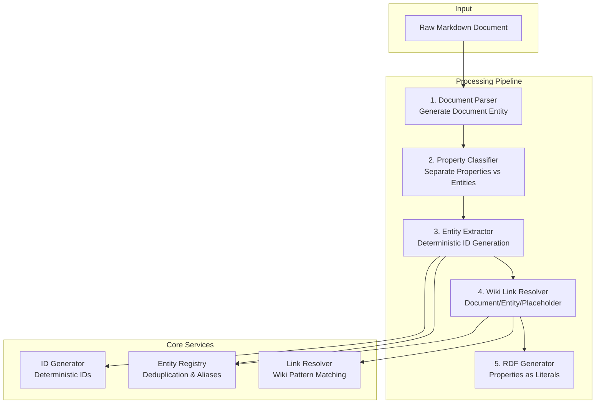

# ADR-0012: Entity Modeling with Wiki-Based Architecture

**Date:** 2025-07-21

**Status:** Accepted

**Supersedes:** [ADR-0010: Entity Modeling and Transformation for RDF Serialization](0010-entity-modeling-for-rdf-serialization.md)

## Summary of Changes

This ADR supersedes ADR-0010 to incorporate the wiki-based entity ID generation system (ADR-0013) and clarifies the distinction between properties and entities.

## Updated Entity Model Hierarchy

### Root-Level Entities (Global Scope)

1. **Document** - First-class entity representing a markdown file
   - ID Pattern: `/Document/{normalized-path}`
   - Properties: title, created, modified, type
   - Not derived from frontmatter alone

2. **Person** - Individual referenced in documents
   - ID Pattern: `/Person/{normalized-name}`
   - Properties: canonical_name, aliases, email, roles

3. **Organization** - Company or group entity
   - ID Pattern: `/Organization/{normalized-name}`
   - Properties: name, aliases, type, website

4. **Location** - Geographical entity
   - ID Pattern: `/Location/{normalized-name}`
   - Properties: name, type, coordinates, address

5. **Project** - Initiative or project entity
   - ID Pattern: `/Project/{normalized-name}`
   - Properties: name, status, deadlines, repository

6. **Tag** - Categorization entity
   - ID Pattern: `/Tag/{normalized-name}`
   - Properties: name, category, color

### Document-Scoped Entities

1. **Section** - Document structure based on headings
   - ID Pattern: `/Document/{path}/Section/{heading-path}`
   - Properties: heading, level, content

2. **TodoItem** - Task within a document
   - ID Pattern: `/Document/{path}/TodoItem/{line}-{hash}`
   - Properties: description, completed, assignees

3. **CodeBlock** - Code snippet in document
   - ID Pattern: `/Document/{path}/CodeBlock/{hash}`
   - Properties: language, content

### Virtual Entities

1. **PlaceholderDocument** - Non-existent wiki link target
   - ID Pattern: `/PlaceholderDocument/{normalized-name}`
   - Properties: title, referenced_by

## Updated Pipeline Stages

### Stage 1: Document Ingestion & Parsing
- Reader ingests markdown files
- **NEW**: Generate deterministic Document entity with ID from file path
- Parse structure into document model

### Stage 2: Property vs Entity Classification
- **NEW**: Classify frontmatter fields as properties or entity references
- Document properties stored as RDF literals
- Entity references trigger entity creation/lookup

### Stage 3: Entity Extraction & Deduplication
- Extract entities from content and metadata
- **NEW**: Generate deterministic IDs using type-specific algorithms
- **NEW**: Check entity registry for existing entities
- **NEW**: Resolve aliases to canonical entities

### Stage 4: Wiki Link Resolution
- **NEW**: Parse wiki links with type hints
- **NEW**: Resolve to documents, entities, or placeholders
- **NEW**: Create placeholder documents for missing targets

### Stage 5: RDF Serialization
- Convert KB entities to RDF with stable URIs
- **NEW**: Emit document properties as literals
- **NEW**: Emit entity relationships as object properties

## Updated Mermaid Diagram

## Key Changes from Original ADR-0010

1. **Document as Entity**: Documents are now first-class entities, not just containers
2. **Deterministic IDs**: All entities have predictable, stable IDs
3. **Property Distinction**: Clear rules for what becomes an entity vs property
4. **Wiki Link Support**: Native support for wiki-style linking patterns
5. **Deduplication**: Built-in entity deduplication across documents
6. **Placeholder Entities**: Support for forward references to non-existent documents

## Rationale

This updated approach provides:

*   **Clarity**: Explicitly defines different stages of data representation, reducing ambiguity.
*   **Modularity**: Each stage has clear inputs and outputs, facilitating development and testing.
    *   The `Reader & Parser` focuses on document structure and entity creation.
    *   The `Property Classifier` handles the complex task of distinguishing properties from entities.
    *   The `Entity Extractor` handles deterministic ID generation and deduplication.
    *   The `Wiki Link Resolver` manages wiki-style linking and placeholder creation.
    *   The `RDF Generator` focuses on mapping entities and properties to RDF.
*   **Flexibility & Extensibility**:
    *   New KB Entity types can be added by defining new ID patterns and updating extraction rules.
    *   The wiki link resolution can evolve to support new link patterns.
    *   The transformation logic can be incrementally improved.
*   **Strong Typing**: Leverages Pydantic for all intermediate data models, ensuring type safety and validation.
*   **Wiki Compatibility**: Native support for wiki-style linking and document organization.
*   **Deterministic Behavior**: Predictable entity IDs enable reliable cross-document references.

## Impact on Implementation

- Entity models need ID generation methods
- New entity registry service required
- Wiki link parser needs enhancement
- RDF converter must handle properties differently
- Migration tools needed for existing data

## Backwards Compatibility

- Old random IDs will be mapped to new deterministic IDs
- Migration tool will update existing RDF data
- API will support ID lookup by old format during transition

## Related Decisions

*   [ADR-0002: Pydantic for Data Models](0002-pydantic-for-data-models.md)
*   [ADR-0009: Knowledge Graph and RDF Store](0009-knowledge-graph-rdf-store.md)
*   [ADR-0013: Wiki-Based Entity ID Generation and Link Preservation](0013-wiki-based-entity-id-generation-and-link-preservation.md)

## Notes

This ADR represents a significant evolution from the original ADR-0010, incorporating lessons learned about wiki-style knowledge management and the importance of deterministic entity identification. The concrete definitions of the Pydantic KB Entity Models and the RDF ontology will be developed as part of the implementation of this decision.