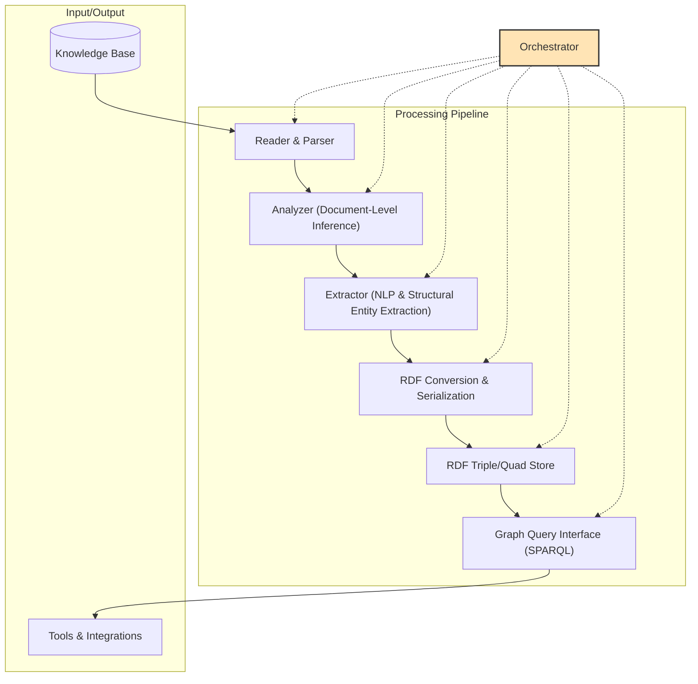

# Plan to Update `components.md` for Pipeline and Orchestrator Clarification

## 1. Clarify Orchestrator Role

- Update the Orchestrator section to emphasize its role as the pipeline manager, not just a stage.
- Adjust the Mermaid diagram so the Orchestrator is visually shown as managing the pipeline, not as a peer stage.

## 2. Clarify Pipeline Structure

- Revise the Mermaid diagram to show the Orchestrator as an overarching controller.
- Add a brief explanatory section on pipeline orchestration and flow.

## 3. Update Extractor Description

- Change the Extractor’s purpose and responsibilities to focus on NLP and structural entity extraction only.
- Remove or move relationship extraction to another component if needed.

## 4. Explicit Entities as Python Objects

- Add a note in the Extractor or a new “Design Considerations” subsection stating that explicit entities should be modeled as Python objects where possible.

## 5. Diagram Update

- Update the Mermaid diagram to reflect the above changes, showing the Orchestrator as the pipeline manager and clarifying the Extractor’s role.

---

## Example (Mermaid) Diagram Update

---

## Section-by-Section Update Plan

- **Overview:** Add a sentence about the Orchestrator managing the pipeline.
- **Component Diagram:** Update diagram and legend.
- **Orchestrator Section:** Emphasize end-to-end management.
- **Extractor Section:** Focus on entity extraction (NLP/structural), not relationships.
- **Component Interactions:** Clarify Orchestrator’s role as coordinator.
- **Design Considerations:** Add note about explicit entities as Python objects.