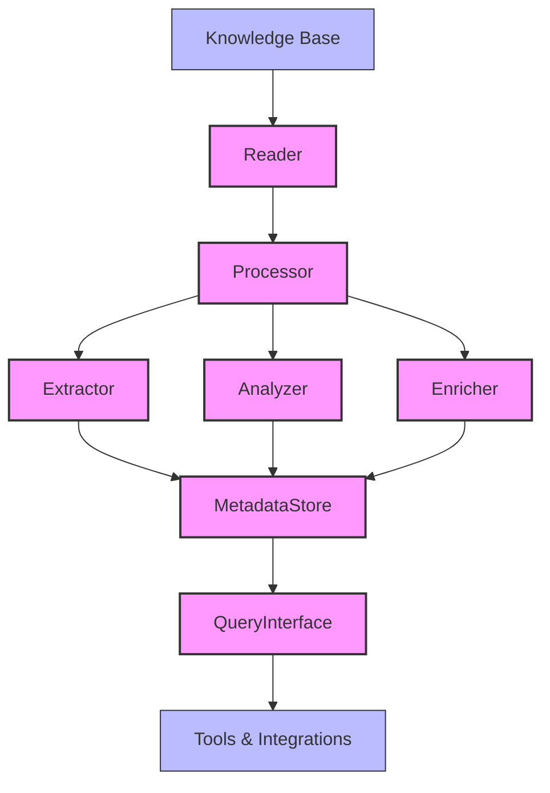

# System Components

## Revision History

| Version | Date       | Author | Changes                              |
|---------|------------|--------|--------------------------------------|
| 0.1     | YYYY-MM-DD | [Name] | Initial draft                        |

## Overview

The Knowledge Base Processor is composed of several logical components that work together to extract, process, and store metadata from a personal knowledge base. This document outlines these components and their relationships.

## Component Diagram

## Core Components

### 1. Reader

**Purpose**: Reads content from the knowledge base in its native format.

**Responsibilities**:
- Access the knowledge base in a read-only manner
- Parse different content formats (Markdown, text, etc.)
- Provide a consistent interface for downstream components
- Track which content has been processed

**Interfaces**:
- Input: Knowledge base location/access method
- Output: Normalized content objects

### 2. Processor

**Purpose**: Orchestrates the metadata extraction and processing workflow.

**Responsibilities**:
- Coordinate the overall processing flow
- Determine which extractors, analyzers, and enrichers to apply
- Handle processing errors and retries
- Manage processing state

**Interfaces**:
- Input: Normalized content from Reader
- Output: Directs content to appropriate sub-components

### 3. Extractor

**Purpose**: Extracts explicit metadata from content.

**Responsibilities**:
- Extract frontmatter, tags, and other explicit metadata
- Parse structured elements (tables, lists, etc.)
- Identify references and links
- Extract dates, titles, and other basic metadata

**Interfaces**:
- Input: Content from Processor
- Output: Explicit metadata

### 4. Analyzer

**Purpose**: Derives implicit metadata through content analysis.

**Responsibilities**:
- Identify topics and themes
- Extract entities (people, places, concepts)
- Determine content categories
- Calculate relevance scores for extracted metadata

**Interfaces**:
- Input: Content from Processor
- Output: Derived metadata

### 5. Enricher

**Purpose**: Enhances metadata with additional context and relationships.

**Responsibilities**:
- Connect related content items
- Establish hierarchical relationships
- Enhance metadata with additional context
- Generate summaries or abstracts

**Interfaces**:
- Input: Content and metadata from Processor
- Output: Enhanced metadata

### 6. Metadata Store

**Purpose**: Stores and manages extracted metadata.

**Responsibilities**:
- Store metadata in a queryable format
- Maintain relationships between content and metadata
- Support efficient retrieval patterns
- Ensure metadata integrity

**Interfaces**:
- Input: Metadata from Extractors, Analyzers, and Enrichers
- Output: Stored metadata accessible via Query Interface

### 7. Query Interface

**Purpose**: Provides access to stored metadata.

**Responsibilities**:
- Support queries for different metadata types
- Enable filtering and sorting
- Provide integration points for external tools
- Support both programmatic and user-friendly access

**Interfaces**:
- Input: Query parameters
- Output: Metadata results

## External Components

### Knowledge Base

The existing personal knowledge base that contains the content to be processed. This is considered external to the system as it is not modified by the Knowledge Base Processor.

### Tools & Integrations

External tools that consume the processed metadata to provide additional functionality, such as visualization, search, or integration with other personal productivity tools.

## Component Interactions

1. The **Reader** accesses the knowledge base and normalizes content.
2. The **Processor** receives normalized content and coordinates processing.
3. The **Extractor**, **Analyzer**, and **Enricher** process the content to generate metadata.
4. The **Metadata Store** saves the processed metadata.
5. The **Query Interface** provides access to the stored metadata.
6. External **Tools & Integrations** use the Query Interface to access and utilize the metadata.

## Design Considerations

### Modularity

Components are designed to be modular, allowing for:
- Independent development and testing
- Selective activation based on needs
- Easy replacement of individual components

### Statelessness

Core processing components (Extractor, Analyzer, Enricher) are designed to be stateless, making them:
- Easier to test
- More reliable
- Potentially parallelizable if needed

### Extensibility

The system is designed to be extensible in key areas:
- New extractors can be added for different content types
- Additional analyzers can be developed for specific metadata needs
- New enrichers can be created to enhance metadata in different ways

### Simplicity

In keeping with the lightweight, personal-use focus:
- Components have clear, focused responsibilities
- Interfaces between components are straightforward
- Implementation complexity is minimized where possible