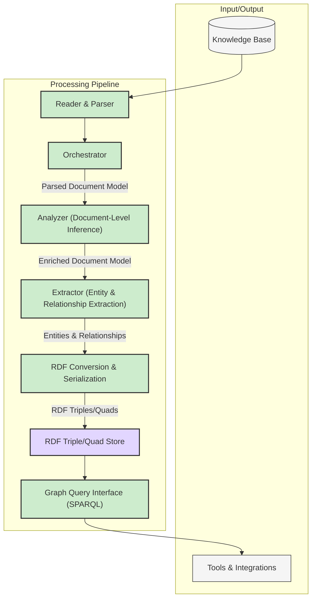

# System Components

## Revision History

| Version | Date       | Author        | Changes                                                                 |
|---------|------------|---------------|-------------------------------------------------------------------------|
| 0.2     | 2025-05-18 | Roo (AI Asst) | Updated components for Knowledge Graph/RDF architecture as per ADR-0009. |
| 0.1     | YYYY-MM-DD | [Name]        | Initial draft                                                           |

## Overview

The Knowledge Base Processor is composed of several logical components that work together to read, parse, analyze, and transform content from a personal knowledge base into a queryable RDF knowledge graph. This document outlines these components and their relationships, reflecting the architecture described in [ADR-0009](../decisions/0009-knowledge-graph-rdf-store.md).

## Component Diagram

## Core Components

### 1. Reader & Parser (Previously Reader)

**Purpose**: Reads content from the knowledge base (Markdown files) and parses it into a structured internal representation.

**Responsibilities**:
- Access the knowledge base files.
- Parse Markdown syntax (frontmatter, headings, paragraphs, links, code blocks, etc.).
- Create a "Parsed Document Model" – a structured object representing the document's content and explicit metadata.
- Track which content has been processed.

**Interfaces**:
- Input: Knowledge base location (file paths).
- Output: Parsed Document Model objects.

### 2. Orchestrator (Previously Processor)

**Purpose**: Orchestrates the overall data processing workflow from document parsing to RDF graph population.

**Responsibilities**:
- Coordinate the flow of data through Analyzer, Extractor, and RDFConverter components.
- Manage the sequence of operations for each document.
- Handle processing errors and logging.

**Interfaces**:
- Input: Parsed Document Model from Reader & Parser.
- Output: Directs data to subsequent components (Analyzer, Extractor).

### 3. Analyzer (Document-Level Inference)

**Purpose**: Performs analysis on the Parsed Document Model to infer document-wide attributes and enrich the model.

**Responsibilities**:
- Identify main topics or themes of the document.
- Generate or suggest relevant tags/keywords.
- Potentially create document summaries.
- This stage enriches the Parsed Document Model before specific entities and relationships are extracted for the graph.

**Interfaces**:
- Input: Parsed Document Model from Orchestrator.
- Output: Enriched Document Model (with inferred topics, tags, etc.).

### 4. Extractor (Entity & Relationship Extraction)

**Purpose**: Identifies and extracts specific entities and the relationships between them from the Enriched Document Model.

**Responsibilities**:
- Recognize named entities (People, Organizations, Locations, Dates, Projects, Meetings, Concepts like "ToDo Item") and assign them types.
- Identify relationships between these entities (e.g., "Person A *attends* Meeting X", "Document Z *mentions* Topic Y").
- Utilize both explicit information (e.g., from frontmatter, wikilinks) and context from the document content.

**Interfaces**:
- Input: Enriched Document Model from Analyzer.
- Output: A structured list of identified entities and relationships.

### 5. RDF Conversion & Serialization (New Component)

**Purpose**: Transforms the extracted entities and relationships into RDF triples or quads.

**Responsibilities**:
- Map entities to RDF resources (assigning URIs).
- Map entity types to RDF classes (e.g., `foaf:Person`, `kb:Meeting`).
- Map entity attributes to RDF properties (e.g., `foaf:name`, `dcterms:title`).
- Map relationships to RDF predicates (e.g., `kb:attends`, `kb:discussesTopic`).
- Serialize the RDF data into a standard format (e.g., Turtle, N-Quads, JSON-LD).
- Potentially assign triples/quads to named graphs (e.g., based on source document URI for provenance).

**Interfaces**:
- Input: Structured list of entities and relationships from Extractor.
- Output: RDF data (e.g., a stream of triples/quads or a serialized RDF document).

### 6. RDF Triple/Quad Store (Previously Metadata Store)

**Purpose**: Stores, manages, and indexes the generated RDF data, forming the knowledge graph.

**Responsibilities**:
- Persist RDF triples/quads.
- Provide mechanisms for adding, updating, and deleting RDF data.
- Index the RDF data efficiently to support SPARQL queries.
- Ensure data integrity and consistency within the graph.
- Support transactions if applicable.

**Interfaces**:
- Input: RDF data from the RDF Conversion & Serialization component.
- Output: Provides data access to the Graph Query Interface.

### 7. Graph Query Interface (SPARQL) (Previously Query Interface)

**Purpose**: Provides a standardized interface (SPARQL endpoint) to query the RDF Triple/Quad Store.

**Responsibilities**:
- Accept SPARQL queries.
- Execute queries against the RDF data in the store.
- Return query results in standard SPARQL result formats (e.g., JSON, XML, CSV) or RDF serializations.
- Support various SPARQL query forms (SELECT, CONSTRUCT, ASK, DESCRIBE).

**Interfaces**:
- Input: SPARQL query strings and potentially request parameters (e.g., for result format).
- Output: Query results.

## External Components

### Knowledge Base
The existing personal knowledge base (collection of Markdown files) that contains the content to be processed. This is read-only from the perspective of the processor.

### Tools & Integrations
External tools or applications that consume the knowledge graph via the Graph Query Interface (SPARQL) to provide functionalities like advanced search, visualization, question answering, or integration with other productivity tools.

## Component Interactions

1.  The **Reader & Parser** accesses the Knowledge Base, reads Markdown files, and produces a Parsed Document Model for each.
2.  The **Orchestrator** receives the Parsed Document Model and directs it to the **Analyzer**.
3.  The **Analyzer** performs document-level inference, enriching the document model.
4.  The **Orchestrator** passes the Enriched Document Model to the **Extractor**.
5.  The **Extractor** identifies entities and relationships, outputting them in a structured format.
6.  The **Orchestrator** sends this structured data to the **RDF Conversion & Serialization** component.
7.  The **RDF Conversion & Serialization** component transforms the data into RDF triples/quads and sends them to the **RDF Triple/Quad Store**.
8.  The **RDF Triple/Quad Store** persists and indexes the RDF data.
9.  The **Graph Query Interface (SPARQL)** provides an endpoint for external **Tools & Integrations** to query the knowledge graph.

## Design Considerations

### Modularity
Components are designed with clear responsibilities and interfaces, allowing for independent development, testing, and potential replacement or enhancement.

### Statelessness
Where feasible, processing components like the Analyzer, Extractor, and RDF Converter aim to be stateless, processing input and producing output without retaining state between invocations for a given document. The RDF Store is inherently stateful.

### Extensibility
The architecture supports extensibility:
- New parsing capabilities can be added to the Reader & Parser.
- New analysis techniques can be incorporated into the Analyzer.
- Entity and relationship extraction rules in the Extractor can be expanded.
- The RDF model can be extended with new vocabulary terms (classes and properties).
- Different RDF Triple/Quad Store backends can be adopted.

### Simplicity
While the overall system processes complex data, individual components strive for clear, focused responsibilities to manage complexity. The use of RDF and SPARQL introduces powerful standards but also a learning curve.