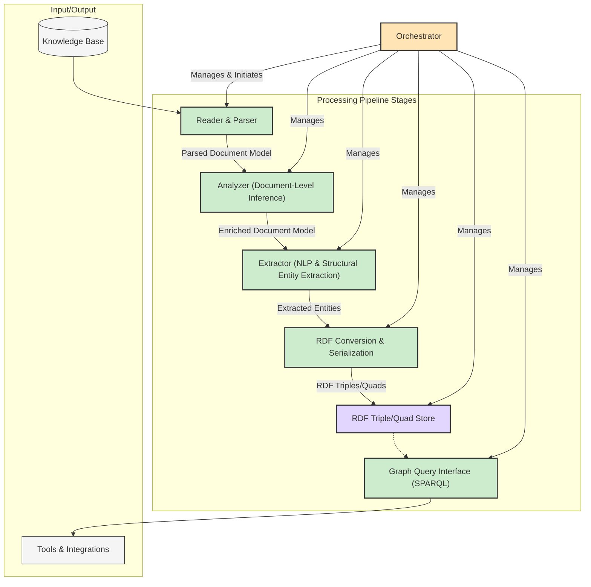

# System Components

## Revision History

| Version | Date       | Author        | Changes                                                                 |
|---------|------------|---------------|-------------------------------------------------------------------------|
| 0.4     | 2025-05-20 | Roo (AI Asst) | Updated diagram and interactions to show direct stage flow managed by Orchestrator. |
| 0.3     | 2025-05-20 | Roo (AI Asst) | Clarified Orchestrator role, pipeline structure, and Extractor scope. Added entity modeling note. |
| 0.2     | 2025-05-18 | Roo (AI Asst) | Updated components for Knowledge Graph/RDF architecture as per ADR-0009. |
| 0.1     | YYYY-MM-DD | [Name]        | Initial draft                                                           |

## Overview

The Knowledge Base Processor is composed of several logical components that work together under the management of an **Orchestrator** to read, parse, analyze, and transform content from a personal knowledge base into a queryable RDF knowledge graph. This document outlines these components and their relationships, reflecting the architecture described in [ADR-0009](../decisions/0009-knowledge-graph-rdf-store.md). The Orchestrator manages the end-to-end processing pipeline, coordinating the flow of data between stages.

## Component Diagram

## Core Components

### 1. Orchestrator (Previously Processor)

**Purpose**: Manages and coordinates the entire data processing pipeline, from initial document ingestion to final RDF graph population and query. It ensures a seamless flow of data through various specialized components by initiating processes and overseeing their execution.

**Responsibilities**:
- Initiate the processing pipeline starting with the Reader & Parser.
- Control the overall sequence of operations and ensure data flows correctly between the Reader & Parser, Analyzer, Extractor, RDF Conversion & Serialization, and RDF Store.
- Monitor the status of each processing stage.
- Handle pipeline-level error management, logging, and status tracking.
- Provide a central point of control and configuration for the processing workflow.

**Interfaces**:
- Input: Configuration for the processing run, signals to start processing.
- Output: Final status of the processing, logs, and indirectly, the populated RDF Store.
- Interacts with: All other core components by initiating their tasks, monitoring them, and managing the overall workflow.

### 2. Reader & Parser (Previously Reader)

**Purpose**: Reads content from the knowledge base (Markdown files) and parses it into a structured internal representation. This is the first active stage in the pipeline.

**Responsibilities**:
- Access the knowledge base files upon instruction from the Orchestrator.
- Parse Markdown syntax (frontmatter, headings, paragraphs, links, code blocks, etc.).
- Create a "Parsed Document Model" – a structured object representing the document's content and explicit metadata.
- Track which content has been processed.

**Interfaces**:
- Input: Knowledge base location (file paths), invocation triggered by Orchestrator.
- Output: Parsed Document Model objects to the Analyzer.

### 3. Analyzer (Document-Level Inference)

**Purpose**: Performs analysis on the Parsed Document Model to infer document-wide attributes and enrich the model.

**Responsibilities**:
- Identify main topics or themes of the document.
- Generate or suggest relevant tags/keywords.
- Potentially create document summaries.
- This stage enriches the Parsed Document Model before specific entities are extracted.

**Interfaces**:
- Input: Parsed Document Model from the Reader & Parser.
- Output: Enriched Document Model (with inferred topics, tags, etc.) to the Extractor.

### 4. Extractor (NLP & Structural Entity Extraction)

**Purpose**: Identifies and extracts specific entities from the Enriched Document Model using Natural Language Processing (NLP) techniques and structural analysis.

**Responsibilities**:
- Recognize named entities (People, Organizations, Locations, Dates, Projects, Meetings, Concepts like "ToDo Item") using NLP.
- Extract entities based on structural cues in the document (e.g., from frontmatter, wikilinks, specific Markdown patterns).
- Assign types to identified entities.
- Model explicit entities as Python objects where possible.

**Interfaces**:
- Input: Enriched Document Model from the Analyzer.
- Output: A structured list of identified entities to the RDF Conversion & Serialization component.

### 5. RDF Conversion & Serialization

**Purpose**: Transforms the extracted entities into RDF triples or quads.

**Responsibilities**:
- Map entities to RDF resources (assigning URIs).
- Map entity types to RDF classes (e.g., `foaf:Person`, `kb:Meeting`).
- Map entity attributes to RDF properties (e.g., `foaf:name`, `dcterms:title`).
- Serialize the RDF data into a standard format (e.g., Turtle, N-Quads, JSON-LD).
- Potentially assign triples/quads to named graphs (e.g., based on source document URI for provenance).

**Interfaces**:
- Input: Structured list of entities from the Extractor.
- Output: RDF data (e.g., a stream of triples/quads or a serialized RDF document) to the RDF Triple/Quad Store.

### 6. RDF Triple/Quad Store (Previously Metadata Store)

**Purpose**: Stores, manages, and indexes the generated RDF data, forming the knowledge graph.

**Responsibilities**:
- Persist RDF triples/quads received from the RDF Conversion & Serialization component.
- Provide mechanisms for adding, updating, and deleting RDF data.
- Index the RDF data efficiently to support SPARQL queries.
- Ensure data integrity and consistency within the graph.
- Support transactions if applicable.

**Interfaces**:
- Input: RDF data from the RDF Conversion & Serialization component.
- Output: Provides data access to the Graph Query Interface.

### 7. Graph Query Interface (SPARQL) (Previously Query Interface)

**Purpose**: Provides a standardized interface (SPARQL endpoint) to query the RDF Triple/Quad Store. This interface is managed and exposed under the Orchestrator's control.

**Responsibilities**:
- Accept SPARQL queries.
- Execute queries against the RDF data in the store.
- Return query results in standard SPARQL result formats (e.g., JSON, XML, CSV) or RDF serializations.
- Support various SPARQL query forms (SELECT, CONSTRUCT, ASK, DESCRIBE).

**Interfaces**:
- Input: SPARQL query strings and potentially request parameters (e.g., for result format).
- Output: Query results.

## External Components

### Knowledge Base
The existing personal knowledge base (collection of Markdown files) that contains the content to be processed. This is read-only from the perspective of the processor.

### Tools & Integrations
External tools or applications that consume the knowledge graph via the Graph Query Interface (SPARQL) to provide functionalities like advanced search, visualization, question answering, or integration with other productivity tools.

## Component Interactions & Pipeline Flow

The **Orchestrator** initiates and manages the processing pipeline, while data flows sequentially through the stages:

1.  The **Orchestrator** initiates processing by instructing the **Reader & Parser** to access the Knowledge Base.
2.  The **Reader & Parser** reads Markdown files and produces a Parsed Document Model, passing it directly to the **Analyzer**.
3.  The **Analyzer** performs document-level inference, enriching the model, and passes the Enriched Document Model directly to the **Extractor**.
4.  The **Extractor** identifies entities and passes the structured list of entities directly to the **RDF Conversion & Serialization** component.
5.  The **RDF Conversion & Serialization** component transforms the data into RDF triples/quads and sends them directly to the **RDF Triple/Quad Store** for persistence.
6.  The **Orchestrator** oversees this entire flow, managing errors, logging, and coordination between stages.
7.  The **Graph Query Interface (SPARQL)**, managed by the Orchestrator, provides an endpoint for external **Tools & Integrations** to query the knowledge graph stored in the **RDF Triple/Quad Store**.

## Design Considerations

### Modularity
Components are designed with clear responsibilities and interfaces, allowing for independent development, testing, and potential replacement or enhancement. The Orchestrator ensures these modular components work together cohesively in a defined sequence.

### Statelessness
Where feasible, processing components like the Analyzer, Extractor, and RDF Converter aim to be stateless, processing input and producing output without retaining state between invocations for a given document. The RDF Store is inherently stateful. The Orchestrator manages the state and progress of the overall pipeline flow.

### Extensibility
The architecture supports extensibility:
- New parsing capabilities can be added to the Reader & Parser.
- New analysis techniques can be incorporated into the Analyzer.
- Entity extraction rules and NLP models in the Extractor can be expanded or updated.
- The RDF model can be extended with new vocabulary terms (classes and properties).
- Different RDF Triple/Quad Store backends can be adopted.

### Entity Modeling
Explicit entities identified by the **Extractor** should be modeled as Python objects where possible. This allows for strong typing, validation, and easier manipulation within the Python-based processing pipeline before conversion to RDF.

### Simplicity
While the overall system processes complex data, individual components strive for clear, focused responsibilities to manage complexity. The Orchestrator simplifies the overall control flow by managing the sequence and interaction of these components. The use of RDF and SPARQL introduces powerful standards but also a learning curve.