# Data Flow

## Revision History

| Version | Date       | Author        | Changes                                                                 |
|---------|------------|---------------|-------------------------------------------------------------------------|
| 0.2     | 2025-05-18 | Roo (AI Asst) | Revised data flow for Knowledge Graph/RDF architecture. Updated diagram, transformations, and models. |
| 0.1     | YYYY-MM-DD | [Name]        | Initial draft                                                           |

## Overview

This document describes how data flows through the Knowledge Base Processor system, from the initial raw content in the knowledge base to the final structured knowledge graph representation in an RDF triple/quad store, which can then be queried. This revised flow reflects the architectural shift towards a knowledge graph model as per [ADR-0009](../decisions/0009-knowledge-graph-rdf-store.md).

## High-Level Data Flow

The new data flow emphasizes a multi-stage process, transforming raw documents into a queryable knowledge graph:

```mermaid
flowchart LR
    A[Raw Markdown Document] --> B[Parsed Document Model]
    B --> C[Document-Level Inference - Topics, Tags, etc.]
    C --> D[Entity & Relationship Extraction]
    D --> E[Typed Graph Nodes & Edges RDF Triples/Quads]
    E --> F[RDF Triple/Quad Store]
    F --> G[Graph Query Interface - SPARQL]

    style A fill:#f5f5f5,stroke:#333,stroke-width:1px
    style B fill:#d4f1f9,stroke:#333,stroke-width:1px
    style C fill:#cdeccd,stroke:#333,stroke-width:1px
    style D fill:#f9e79f,stroke:#333,stroke-width:1px
    style E fill:#f5cba7,stroke:#333,stroke-width:1px
    style F fill:#e2d6ff,stroke:#333,stroke-width:1px
    style G fill:#ffe6cc,stroke:#333,stroke-width:1px
```



## Data Transformations

### 1. Raw Markdown Document → Parsed Document Model

**Performed by**: Reader Component & Markdown Parser Component

**Transformation**:
- Content is read from its native Markdown format.
- Markdown syntax (frontmatter, headings, lists, links, code blocks, etc.) is parsed into a structured tree or object model.
- This model represents the document's explicit structure and content elements.
- Basic source metadata (filename, path, modification date) is captured.

**Example**:
```
Raw: A Markdown file with YAML frontmatter, headings, paragraphs, and wikilinks.
↓
Parsed Document Model: An object representing the document's structure, including:
  - Frontmatter: as a key-value map.
  - Sections: hierarchical structure based on headings.
  - Content Blocks: paragraphs, lists, code blocks, etc.
  - Links: extracted with their text and target.
  - Source Path: "sample_data/MyNote.md"
```

### 2. Parsed Document Model → Document-Level Inference

**Performed by**: Analyzer Component (Topic Modeling, Tag Generation, Summarization modules)

**Transformation**:
- The content of the Parsed Document Model is analyzed to infer higher-level document-wide attributes.
- This can include:
    - **Topic Identification**: Determining main topics or themes of the document.
    - **Tag/Keyword Generation**: Suggesting relevant tags or keywords based on content.
    - **Summarization**: Creating a concise summary of the document.
    - **Language Detection**: Identifying the primary language of the document.
- These inferences enrich the document model before specific entities and relationships are extracted for the graph.

**Example**:
```
Parsed Document Model: Structured content of "MyNote.md".
↓
Document-Level Inference attached to the model:
  - Inferred Topics: ["Software Architecture", "Knowledge Graphs", "RDF"]
  - Suggested Tags: ["adr", "data-modeling", "semantics"]
  - Summary: "This note discusses the shift to an RDF-based knowledge graph..."
```

### 3. Document-Level Inference → Entity & Relationship Extraction

**Performed by**: Extractor Component (Entity Recognition, Relationship Extraction modules)

**Transformation**:
- The Parsed Document Model (now enriched with document-level inferences) is processed to identify specific entities and the relationships between them.
- **Entities**: Named entities (People, Organizations, Locations, Dates, Projects, Meetings, Concepts like "ToDo Item") are recognized and typed.
- **Relationships**: Connections between these entities are identified (e.g., "Person A *attends* Meeting X", "Meeting X *discusses* Topic Y", "Document Z *mentions* Person A").
- Explicitly stated metadata (e.g., from frontmatter) and implicitly derived information are used.

**Example**:
```
Enriched Document Model for "MyNote.md"
↓
Extracted Entities & Relationships:
  - Entity: { id: "person_jane_doe", type: "Person", name: "Jane Doe" }
  - Entity: { id: "meeting_project_alpha_20251107", type: "Meeting", label: "Project Alpha Sync", date: "2025-11-07" }
  - Entity: { id: "topic_knowledge_graph", type: "Topic", label: "Knowledge Graph" }
  - Relationship: { source: "person_jane_doe", type: "attended", target: "meeting_project_alpha_20251107" }
  - Relationship: { source: "meeting_project_alpha_20251107", type: "discussedTopic", target: "topic_knowledge_graph" }
```

### 4. Entity & Relationship Extraction → Typed Graph Nodes & Edges (RDF Triples/Quads)

**Performed by**: RDF Conversion/Serialization Component

**Transformation**:
- The extracted entities and relationships are transformed into RDF statements (triples or quads).
- **Entities become RDF Resources (Nodes)**: Each entity is assigned a URI (e.g., `kb:person_jane_doe`). Properties of the entity (name, type) become RDF properties attached to this resource (e.g., `kb:person_jane_doe rdf:type foaf:Person; foaf:name "Jane Doe".`).
- **Relationships become RDF Predicates (Edges)**: Relationships link two RDF resources (e.g., `kb:person_jane_doe meeting:attended kb:meeting_project_alpha_20251107.`).
- Literals (strings, numbers, dates) are used for attribute values.
- Quads can be used to associate statements with a named graph, often representing the source document URI.

**Example (Turtle Syntax for RDF)**:
```turtle
@prefix kb: <http://example.org/kb/> .
@prefix foaf: <http://xmlns.com/foaf/0.1/> .
@prefix meeting: <http://example.org/ontology/meeting/> .
@prefix dcterms: <http://purl.org/dc/terms/> .
@prefix xsd: <http://www.w3.org/2001/XMLSchema#> .

kb:person_jane_doe a foaf:Person ;
    foaf:name "Jane Doe" .

kb:meeting_project_alpha_20251107 a meeting:Meeting ;
    dcterms:title "Project Alpha Sync" ;
    dcterms:date "2025-11-07"^^xsd:date ;
    meeting:discussedTopic kb:topic_knowledge_graph .

kb:person_jane_doe meeting:attended kb:meeting_project_alpha_20251107 .

kb:topic_knowledge_graph a dcterms:Subject ;
    dcterms:title "Knowledge Graph" .

# Example of a quad (if using named graphs, e.g., associating with source document)
# kb:source_MyNote_md {
#   kb:person_jane_doe meeting:attended kb:meeting_project_alpha_20251107 .
# }
```

### 5. RDF Triples/Quads → RDF Triple/Quad Store

**Performed by**: Metadata Store Component (RDF Store Interface)

**Transformation**:
- The generated RDF triples/quads are loaded into a persistent RDF triple/quad store.
- The store indexes the RDF data to enable efficient querying.
- This store becomes the primary source for structured, queryable knowledge.

**Example**:
```
RDF Triples/Quads (e.g., in Turtle or N-Quads format)
↓
Stored & Indexed in RDF Database (e.g., Apache Jena TDB, Oxigraph, RDF4J Native Store)
```

### 6. RDF Triple/Quad Store → Graph Query Interface (SPARQL)

**Performed by**: Query Interface Component (SPARQL Endpoint)

**Transformation**:
- The RDF store provides a query endpoint, typically supporting SPARQL.
- User queries (or programmatic queries) are formulated in SPARQL.
- The SPARQL engine in the RDF store executes these queries against the graph data.
- Results are returned in standard formats (e.g., SPARQL JSON Results Format, XML, CSV, RDF serializations).

**Example**:
```
SPARQL Query:
  SELECT ?meetingTitle WHERE {
    kb:person_jane_doe meeting:attended ?meeting .
    ?meeting dcterms:title ?meetingTitle .
  }
↓
Query Results: (e.g., JSON)
  { "results": { "bindings": [ { "meetingTitle": { "type": "literal", "value": "Project Alpha Sync" } } ] } }
```

## Data Models

### Parsed Document Model (Intermediate)

This model is an internal, structured representation of the source Markdown document after initial parsing. It serves as input for document-level inference and entity/relationship extraction.

```json
{
  "id": "doc_mynote_md", // Derived from file path or a UUID
  "source": {
    "path": "sample_data/MyNote.md",
    "type": "markdown",
    "lastModified": "2023-05-01T12:00:00Z"
  },
  "frontmatter": {
    "title": "My Awesome Note",
    "tags": ["project-x", "research"],
    "created": "2023-04-15"
  },
  "content_elements": [ // Simplified list of elements
    { "type": "heading", "level": 1, "text": "Main Section" },
    { "type": "paragraph", "text": "This note discusses [[Topic A]] and mentions @JaneDoe." },
    { "type": "wikilink", "target": "Topic A", "text": "[[Topic A]]" },
    { "type": "mention", "target": "JaneDoe", "text": "@JaneDoe" }
  ],
  "inferred_metadata": { // Populated by Document-Level Inference stage
    "topics": [ { "uri": "kb:topic_software_architecture", "label": "Software Architecture", "score": 0.85 } ],
    "summary": "A brief summary of the note's content..."
  }
}
```

### Knowledge Graph Model (RDF)

The primary data model for queryable knowledge is an RDF graph. Data is represented as a set of triples (subject, predicate, object) or quads (graph, subject, predicate, object).

**Conceptual RDF Structure (Illustrated with Turtle-like examples):**

-   **Entities as Resources with Types and Properties:**
    ```turtle
    @prefix kb: <http://example.org/kb/> .
    @prefix foaf: <http://xmlns.com/foaf/0.1/> .
    @prefix schema: <http://schema.org/> .
    @prefix dcterms: <http://purl.org/dc/terms/> .

    kb:person_john_smith a foaf:Person ;  # rdf:type
        foaf:name "John Smith" ;
        schema:email "john.smith@example.com" ;
        dcterms:created "2024-01-10T10:00:00Z"^^xsd:dateTime .

    kb:meeting_project_review_20250518 a schema:Event, kb:Meeting ; # Multiple types
        schema:name "Project Review Q2" ;
        schema:startDate "2025-05-18T14:00:00Z"^^xsd:dateTime ;
        schema:location kb:location_room_301 ;
        dcterms:source <file:///workspaces/knowledgebase-processor/sample_data/meeting_notes_20250518.md> .
    ```

-   **Relationships as Predicates:**
    ```turtle
    kb:person_john_smith schema:attendee kb:meeting_project_review_20250518 .
    kb:meeting_project_review_20250518 kb:discussesTopic kb:topic_performance_metrics .
    kb:document_adr0009 dcterms:references kb:person_john_smith . # A document mentioning a person
    ```

-   **Literals for Data Values:**
    - Strings: `"John Smith"`
    - Dates: `"2025-05-18"^^xsd:date`
    - Numbers: `"42"^^xsd:integer`

-   **Vocabularies/Ontologies**: Standard (FOAF, Schema.org, Dublin Core) and custom vocabularies (e.g., `kb:`) will be used to define classes (e.g., `kb:Meeting`, `kb:ToDoItem`) and properties (e.g., `kb:hasStatus`, `kb:assignedTo`).

The actual RDF serialization (e.g., Turtle, N-Triples, JSON-LD) will be chosen based on storage and processing needs.

## Conceptual Query Examples (Illustrative SPARQL)

The following examples illustrate conceptually how the [Core Use Cases](../../use-cases.md) might be addressed by querying the RDF graph using SPARQL.

*   **Use Case:** "When was my last meeting with Jane Doe?"
    *   **Conceptual SPARQL Query:**
        ```sparql
        PREFIX foaf: <http://xmlns.com/foaf/0.1/>
        PREFIX schema: <http://schema.org/>
        PREFIX kb: <http://example.org/kb/>

        SELECT (MAX(?date) AS ?lastMeetingDate)
        WHERE {
          ?person foaf:name "Jane Doe" .
          ?meeting a kb:Meeting ;
                   schema:attendee ?person ;
                   schema:startDate ?date .
        }
        ```

*   **Use Case:** "What are my meeting follow-ups (ToDo items) from my last meeting about Project Alpha?"
    *   **Conceptual SPARQL Query:**
        ```sparql
        PREFIX schema: <http://schema.org/>
        PREFIX kb: <http://example.org/kb/>
        PREFIX dcterms: <http://purl.org/dc/terms/>

        SELECT ?todoText
        WHERE {
          ?meeting a kb:Meeting ;
                   dcterms:title ?meetingTitle ;
                   kb:generatesToDo ?todoItem .
          FILTER CONTAINS(LCASE(?meetingTitle), "project alpha") # Simplified title match
          # Further filter for "last meeting" if needed, e.g., by date

          ?todoItem a kb:ToDoItem ;
                    kb:hasStatus kb:status_Open ; # Assuming kb:status_Open is a defined resource
                    schema:text ?todoText .
        }
        ORDER BY DESC(?meetingDate) # Assuming ?meetingDate is available for the meeting
        LIMIT 10 # For follow-ups from the most recent relevant meeting
        ```

*   **Use Case:** "How do I know John Smith?" (Show contexts where John Smith is mentioned)
    *   **Conceptual SPARQL Query:**
        ```sparql
        PREFIX foaf: <http://xmlns.com/foaf/0.1/>
        PREFIX dcterms: <http://purl.org/dc/terms/>
        PREFIX kb: <http://example.org/kb/>

        SELECT ?sourceDocument ?mentionContext (COUNT(?mention) AS ?mentionCount)
        WHERE {
          ?person foaf:name "John Smith" .
          # Assuming mentions are reified or linked to source documents
          ?mention kb:refersToEntity ?person ;
                   kb:hasContext ?mentionContext ;
                   dcterms:source ?sourceDocument . # URI of the source document
        }
        GROUP BY ?sourceDocument ?mentionContext
        ORDER BY DESC(?mentionCount)
        LIMIT 5
        ```

*   **Use Case:** "What is my list of writing ideas (ToDo items) that haven't been completed?"
    *   **Conceptual SPARQL Query:**
        ```sparql
        PREFIX schema: <http://schema.org/>
        PREFIX kb: <http://example.org/kb/>

        SELECT ?ideaText
        WHERE {
          ?todoItem a kb:ToDoItem ;
                    kb:hasCategory kb:category_WritingIdea ; # Assuming a category system
                    kb:hasStatus kb:status_Open ;
                    schema:text ?ideaText .
        }
        ```

## Data Flow Considerations

### Incremental Processing
- The system should support incremental processing. When a Markdown file is modified, only the affected parts of the document model and the corresponding RDF triples/quads should be updated in the store.
- This might involve deleting old triples related to the document and inserting new ones. Strategies like using named graphs per document can facilitate this.

### Data Integrity
- URIs for resources (entities, documents) must be stable and consistently generated.
- Vocabulary terms (classes and properties) should be managed, potentially using a simple ontology.
- Provenance of data (e.g., which document a triple originated from) can be tracked using quads/named graphs or reification.

### Performance Considerations
- SPARQL query performance will depend on the chosen RDF store, the size of the graph, and the complexity of queries. Indexing strategies within the RDF store are crucial.
- For a personal-use system, batch processing for graph updates is acceptable. Query performance for common use cases should be prioritized.

### Storage Efficiency
- RDF can be verbose. Choosing efficient serialization formats (e.g., Turtle, or binary RDF formats if supported by the store) for storage or transfer can be important.
- The RDF store itself will have its own storage footprint.

### Schema and Ontology Management
- A basic ontology defining custom classes (e.g., `kb:Meeting`, `kb:ToDoItem`, `kb:Project`) and properties (e.g., `kb:discussesTopic`, `kb:hasStatus`, `kb:assignedTo`) will be necessary.
- Standard vocabularies (FOAF, Schema.org, DCTerms) should be reused where possible.