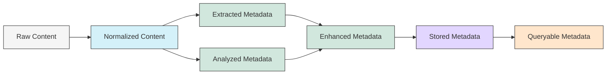

# Data Flow

## Revision History

| Version | Date       | Author | Changes                              |
|---------|------------|--------|--------------------------------------|
| 0.1     | YYYY-MM-DD | [Name] | Initial draft                        |

## Overview

This document describes how data flows through the Knowledge Base Processor system, from the initial content in the knowledge base to the final structured metadata that can be queried and utilized.

## High-Level Data Flow



## Data Transformations

### 1. Raw Content → Normalized Content

**Performed by**: Reader Component

**Transformation**:
- Content is read from its native format (Markdown, text, etc.)
- Formatting is parsed and normalized
- Content is structured into a consistent internal representation
- Basic metadata like filename, path, and modification date are captured

**Example**:
```
Raw: A Markdown file with frontmatter, headings, and text
↓
Normalized: An object with parsed frontmatter, content sections, and basic metadata
```

### 2. Normalized Content → Extracted Metadata

**Performed by**: Extractor Component

**Transformation**:
- Explicit metadata is identified and extracted
- Structured elements are parsed for metadata
- References and links are extracted
- Tags, categories, and other explicit classifications are captured

**Example**:
```
Normalized Content: Parsed document with frontmatter and content
↓
Extracted Metadata: Tags, categories, explicit references, dates
```

### 3. Normalized Content → Analyzed Metadata

**Performed by**: Analyzer Component

**Transformation**:
- Content is analyzed for topics and themes
- Entities (people, places, concepts) are identified
- Implicit categories are determined
- Relevance scores are calculated

**Example**:
```
Normalized Content: Parsed document content
↓
Analyzed Metadata: Topics, entities, sentiment, complexity metrics
```

### 4. Extracted & Analyzed Metadata → Enhanced Metadata

**Performed by**: Enricher Component

**Transformation**:
- Relationships between content items are established
- Hierarchical structures are identified
- Metadata is enriched with additional context
- Summaries or abstracts may be generated

**Example**:
```
Extracted & Analyzed Metadata: Tags, topics, entities
↓
Enhanced Metadata: Related content links, hierarchical categorization, enriched entities
```

### 5. Enhanced Metadata → Stored Metadata

**Performed by**: Metadata Store Component

**Transformation**:
- Metadata is formatted for storage
- Relationships are encoded
- Indexing structures are created
- Metadata is persisted

**Example**:
```
Enhanced Metadata: Rich metadata objects with relationships
↓
Stored Metadata: Persisted data with appropriate indexing
```

### 6. Stored Metadata → Queryable Metadata

**Performed by**: Query Interface Component

**Transformation**:
- Stored metadata is made available through query interfaces
- Query parameters are translated to storage operations
- Results are formatted for consumption
- Access patterns are optimized

**Example**:
```
Stored Metadata: Indexed, persisted metadata
↓
Queryable Metadata: Results formatted for specific query needs
```

## Data Models

### Content Model

The internal representation of content after normalization:

```json
{
  "id": "unique-identifier",
  "source": {
    "path": "path/to/file.md",
    "type": "markdown",
    "lastModified": "2023-05-01T12:00:00Z"
  },
  "content": {
    "title": "Document Title",
    "body": "Normalized content body",
    "sections": [
      {
        "level": 1,
        "title": "Section Title",
        "content": "Section content"
      }
    ]
  },
  "explicit_metadata": {
    "tags": ["tag1", "tag2"],
    "categories": ["category1"],
    "created": "2023-04-15T10:30:00Z"
  }
}
```

### Metadata Model

The representation of processed metadata:

```json
{
  "content_id": "unique-identifier",
  "extracted": {
    "tags": ["tag1", "tag2"],
    "categories": ["category1"],
    "references": [
      {
        "type": "link",
        "target": "another-document-id",
        "context": "Link context"
      }
    ],
    "dates": {
      "created": "2023-04-15T10:30:00Z",
      "mentioned": ["2023-05-10", "2022-11-30"]
    }
  },
  "analyzed": {
    "topics": [
      {
        "name": "Topic Name",
        "confidence": 0.85,
        "keywords": ["keyword1", "keyword2"]
      }
    ],
    "entities": [
      {
        "name": "Entity Name",
        "type": "person",
        "confidence": 0.92,
        "mentions": [
          {
            "position": 156,
            "context": "surrounding text"
          }
        ]
      }
    ],
    "metrics": {
      "complexity": 0.65,
      "sentiment": 0.2
    }
  },
  "enhanced": {
    "related_content": [
      {
        "id": "related-document-id",
        "relationship": "similar-topic",
        "strength": 0.78
      }
    ],
    "hierarchy": {
      "parent": "parent-document-id",
      "children": ["child-document-id"]
    },
    "summary": "Brief generated summary of the content"
  }
}
```

## Data Flow Considerations

### Incremental Processing

The system supports incremental processing, where:
- Only new or modified content is fully processed
- Existing metadata is preserved when possible
- Relationships are updated as needed

### Data Integrity

To maintain data integrity:
- Content IDs provide stable references
- Metadata is versioned alongside content
- Processing errors are tracked and can be addressed

### Performance Considerations

For a personal-use system:
- Processing can be done in batches during idle times
- Full processing of large knowledge bases may be done incrementally
- Query performance is prioritized over processing speed

### Storage Efficiency

To keep the system lightweight:
- Metadata is stored separately from content
- Only necessary information is retained
- Duplicate data is minimized