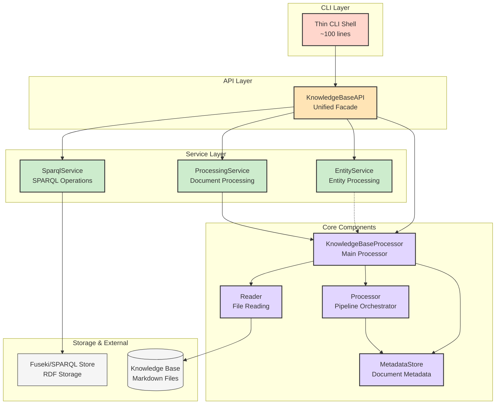

# Service-Oriented Architecture

## Revision History

| Version | Date       | Author        | Changes                                                                 |
|---------|------------|---------------|-------------------------------------------------------------------------|
| 1.0     | 2025-06-28 | Roo (AI Asst) | Initial documentation of service-oriented architecture with KnowledgeBaseAPI. |

## Overview

Following the refactoring described in [Issue #44](https://github.com/dstengle/knowledgebase-processor/issues/44), the Knowledge Base Processor has been transformed from a monolithic CLI application into a well-structured library with a thin CLI shell. This document outlines the new service-oriented architecture with the unified `KnowledgeBaseAPI` as the central facade.

## Architecture Diagram



## Service Components

### 1. KnowledgeBaseAPI (Unified Facade)

**Purpose**: Acts as a single entry point for all knowledge base operations, providing a simplified interface that coordinates between service classes.

**Responsibilities**:
- Initialize and coordinate all service classes
- Provide unified methods for document processing, querying, and entity operations
- Handle configuration propagation to services
- Manage the lifecycle of the main KnowledgeBaseProcessor

**Key Methods**:
```python
# Processing operations
def process_documents(self, pattern: str, rdf_output_dir: Optional[Path] = None) -> int
def process_single_document(self, file_path: Path) -> Document

# Query operations  
def query(self, query_string: str, query_type: str = "text") -> List[Any]
def search(self, query: str) -> List[str]
def find_by_tag(self, tag: str) -> List[str]

# SPARQL operations
def sparql_query(self, query: str, format: str = "json") -> Any
def sparql_load(self, file_path: Path, graph_uri: Optional[str] = None) -> None

# Entity operations
def generate_kb_id(self, entity_type: str, text: str) -> str
def transform_to_kb_entity(self, extracted_entity: ExtractedEntity, source_doc_relative_path: str) -> Optional[KbBaseEntity]
```

**Interfaces**:
- Input: Configuration, processing requests, queries
- Output: Processing results, query results, transformed entities
- Coordinates: EntityService, SparqlService, ProcessingService, KnowledgeBaseProcessor

### 2. EntityService

**Purpose**: Handles entity transformation and knowledge base ID generation.

**Responsibilities**:
- Generate unique KB IDs (URIs) for entities
- Transform ExtractedEntity objects to KbBaseEntity objects
- Handle entity type mapping (PERSON → KbPerson, ORG → KbOrganization, etc.)
- Ensure proper URI encoding and path handling

**Key Methods**:
```python
def generate_kb_id(self, entity_type_str: str, text: str) -> str
def transform_to_kb_entity(self, extracted_entity: ExtractedEntity, source_doc_relative_path: str) -> Optional[KbBaseEntity]
```

**Supported Entity Types**:
- PERSON → KbPerson
- ORG → KbOrganization  
- LOC/GPE → KbLocation
- DATE → KbDateEntity

### 3. SparqlService

**Purpose**: Provides high-level SPARQL operations and query execution.

**Responsibilities**:
- Execute different types of SPARQL queries (SELECT, ASK, CONSTRUCT, DESCRIBE, UPDATE)
- Load RDF files into SPARQL stores
- Handle query result formatting (JSON, table, turtle)
- Manage SPARQL endpoint connections and authentication
- Provide error handling for SPARQL operations

**Key Methods**:
```python
def execute_query(self, query: str, endpoint_url: Optional[str] = None, timeout: int = 30, format: str = "json") -> Any
def load_rdf_file(self, file_path: Path, graph_uri: Optional[str] = None, rdf_format: str = "turtle") -> None
```

**Query Type Support**:
- SELECT queries → JSON or table formatted results
- ASK queries → Boolean results
- CONSTRUCT/DESCRIBE queries → RDF graph results
- UPDATE queries → Execution confirmation

### 4. ProcessingService

**Purpose**: Orchestrates document processing operations and queries.

**Responsibilities**:
- Coordinate document processing with the main KnowledgeBaseProcessor
- Handle RDF output generation with automatic entity analysis enablement
- Process single documents or document collections
- Execute different types of queries (text, tag, topic)
- Manage processor reconfiguration when needed

**Key Methods**:
```python
def process_documents(self, pattern: str, knowledge_base_path: Path, rdf_output_dir: Optional[Path] = None, config=None) -> int
def process_single_document(self, file_path: Path) -> Any
def query_documents(self, query_string: str, query_type: str = "text") -> List[Any]
```

**Auto-Configuration Features**:
- Automatically enables entity analysis when RDF output is requested
- Reinitializes processor with updated configuration as needed
- Registers all required extractors, analyzers, and enrichers

## Integration Patterns

### 1. Service Coordination

The KnowledgeBaseAPI coordinates between services to provide seamless functionality:

```python
# Example: Processing documents with RDF output
def process_documents(self, pattern: str, rdf_output_dir: Optional[Path] = None) -> int:
    return self.processing_service.process_documents(
        pattern=pattern,
        knowledge_base_path=Path(self.config.knowledge_base_path),
        rdf_output_dir=rdf_output_dir,
        config=self.config
    )
```

### 2. Configuration Propagation

Configuration flows from the API to services:

```python
def __init__(self, config: Config):
    self.config = config
    self.kb_processor = KnowledgeBaseProcessor(...)
    self.entity_service = EntityService()
    self.sparql_service = SparqlService(config)  # Config passed to SPARQL service
    self.processing_service = ProcessingService(self.kb_processor)
```

### 3. Error Handling

Services provide consistent error handling patterns:

```python
try:
    result = self.sparql_service.execute_query(query)
except SPARQLWrapperException as e:
    self.logger.error(f"SPARQL query failed: {e}")
    raise
except Exception as e:
    self.logger.error(f"Unexpected error: {e}")
    raise
```

## Testing Architecture

### Unit Tests

Each service has comprehensive unit tests:

- **EntityService**: 16 tests covering KB ID generation, entity transformation, logging
- **SparqlService**: 21 tests covering query execution, file loading, error handling
- **ProcessingService**: 21 tests covering document processing, queries, configuration

### Integration Tests

The KnowledgeBaseAPI has integration tests that verify:

- Service coordination and interaction
- End-to-end processing pipelines
- Configuration propagation
- Error handling across service boundaries

### Test Coverage

- **Total Service Tests**: 58 unit tests
- **Integration Tests**: 13 comprehensive integration scenarios
- **Coverage Areas**: All public methods, error conditions, edge cases, logging

## Benefits of Service-Oriented Architecture

### 1. Separation of Concerns

Each service has a focused responsibility:
- EntityService: Entity processing logic
- SparqlService: SPARQL operations
- ProcessingService: Document processing coordination

### 2. Testability

Services can be tested independently with mocked dependencies, providing:
- Fast unit test execution
- Isolated testing of business logic
- Easy mocking of external dependencies

### 3. Reusability

Services can be used independently of the CLI:

```python
# Library usage example
from knowledgebase_processor import KnowledgeBaseAPI

api = KnowledgeBaseAPI(config)
results = api.search("machine learning")
kb_id = api.generate_kb_id("Person", "John Doe")
```

### 4. Maintainability

- Clear interfaces between components
- Consistent error handling patterns
- Centralized configuration management
- Comprehensive logging throughout

### 5. Extensibility

New functionality can be added by:
- Extending existing services with new methods
- Adding new service classes
- Enhancing the API facade with new operations

## Migration from Previous Architecture

The service-oriented architecture maintains backward compatibility while providing improved structure:

### CLI Layer
- Reduced from 548 lines to ~100 lines
- Focuses only on argument parsing and result presentation
- All business logic moved to services

### Library Layer
- All business logic now accessible through clean APIs
- Services provide granular access to functionality
- KnowledgeBaseAPI provides unified access

### Compatibility
- All existing CLI commands work identically
- Internal APIs are improved but external behavior preserved
- Enhanced error messages and validation

## Future Enhancements

The service architecture enables future improvements:

1. **Additional Services**: New services for advanced analytics, visualization, etc.
2. **Service Composition**: Complex operations built by composing multiple services
3. **External Integration**: Services can be exposed via REST APIs or other interfaces
4. **Performance Optimization**: Services can be optimized independently
5. **Alternative Implementations**: Services can be replaced with alternative implementations

This service-oriented architecture provides a solid foundation for continued evolution while maintaining the simplicity and reliability of the existing system.