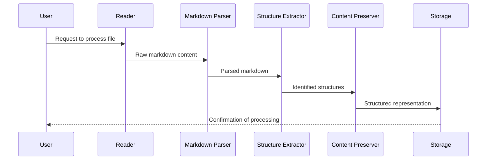

# Markdown Structure Extraction

## Revision History

| Version | Date       | Author | Changes                              |
|---------|------------|--------|--------------------------------------|
| 0.1     | YYYY-MM-DD | [Name] | Initial draft                        |

## Status

Proposed

## Summary

This feature extracts the complete structural elements from markdown files, including headings, sections, lists, tables, code blocks, and todo items, preserving their hierarchical relationships and content context.

## Motivation

The foundation of the Knowledge Base Processor is its ability to understand and represent the structure of markdown documents. By extracting this structure, we create a rich representation that preserves the author's intended organization while enabling enhanced analysis and navigation.

## User Stories

- As a knowledge base owner, I want all structural elements in my markdown files to be accurately extracted, so that I can maintain the original organization while gaining enhanced metadata.
- As a knowledge base owner, I want todo items to be extracted with their status and context, so that I can track and manage tasks across my knowledge base.
- As a knowledge base owner, I want headings and sections to be properly nested, so that I can understand and navigate the hierarchical structure of my documents.

## Detailed Description

The Markdown Structure Extraction feature processes markdown files to identify and extract all structural elements while preserving their relationships and content. It handles:

1. **Document Metadata**: File path, creation date, modification date
2. **Headings**: All levels (H1-H6), preserving hierarchy
3. **Sections**: Content between headings, properly nested
4. **Lists**: Ordered and unordered, with proper nesting
5. **Todo Items**: Checkbox items (`- [ ]` and `- [x]`), with status and containing list/section
6. **Tables**: Full table structure with headers and data
7. **Code Blocks**: Language-specific and plain, with content
8. **Blockquotes**: With proper nesting and content

The extraction process preserves the original markdown content within each structural element, maintaining the full fidelity of the document while creating a structured representation.

## Acceptance Criteria

1. All heading levels (H1-H6) are correctly identified and their hierarchical relationships preserved
2. Lists (ordered and unordered) are extracted with proper nesting and item content
3. Todo items are extracted with their completion status (checked/unchecked) and containing context
4. Tables are extracted with their structure (headers and data cells) intact
5. Code blocks are extracted with their language specification and content
6. Blockquotes are extracted with their content and nesting level
7. All extracted elements maintain references to their original position in the document
8. The full content of each element is preserved in its original form

## Technical Implementation

### Components Involved

| Component | Role |
|-----------|------|
| Reader | Accesses and reads the markdown files from the knowledge base |
| Markdown Parser | Parses the markdown syntax into a structured representation |
| Structure Extractor | Identifies and extracts the structural elements |
| Content Preserver | Maintains the original content within the structured representation |

### Data Model Changes

The feature will introduce the following data structures:

1. **Document**: Represents a markdown file with metadata
   ```json
   {
     "id": "unique-id",
     "path": "path/to/file.md",
     "created": "2023-05-01T10:00:00Z",
     "modified": "2023-05-02T14:30:00Z",
     "elements": [/* array of structural elements */]
   }
   ```

2. **Structural Element**: Base type for all structural elements
   ```json
   {
     "id": "element-id",
     "type": "heading|list|todo|table|code|quote",
     "position": {
       "start": 120,
       "end": 150
     },
     "content": "Original markdown content",
     "parent": "parent-element-id"
   }
   ```

3. **Specific Element Types**: Extended from the base type with additional properties
   - Heading: level (1-6)
   - List: ordered (boolean), items (array)
   - Todo: completed (boolean), text
   - Table: headers (array), rows (array)
   - Code: language, content
   - Quote: level (nesting depth)

### Process Flow



## Dependencies

| Dependency | Type | Status | Notes |
|------------|------|--------|-------|
| Reader Component | Internal | Planned | Needed to access markdown files |
| Markdown Parser Library | External | To be selected | Need to evaluate options |
| Storage Mechanism | Internal | Planned | For storing the extracted structure |

## Limitations and Constraints

- Complex or non-standard markdown syntax may not be fully captured
- Very large markdown files may require optimization for performance
- Custom markdown extensions might not be supported in the initial implementation

## Future Enhancements

- Support for additional markdown extensions and custom syntax
- Performance optimizations for large files
- Incremental parsing for files that change frequently
- Handling of embedded HTML within markdown

## Related Architecture Decisions

- [ADR-0001: Markdown Processing Approach](../architecture/decisions/0001-markdown-processing-approach.md) (to be created)