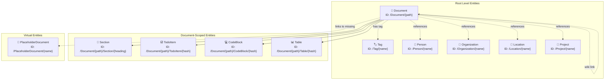
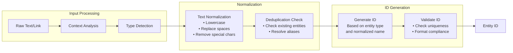
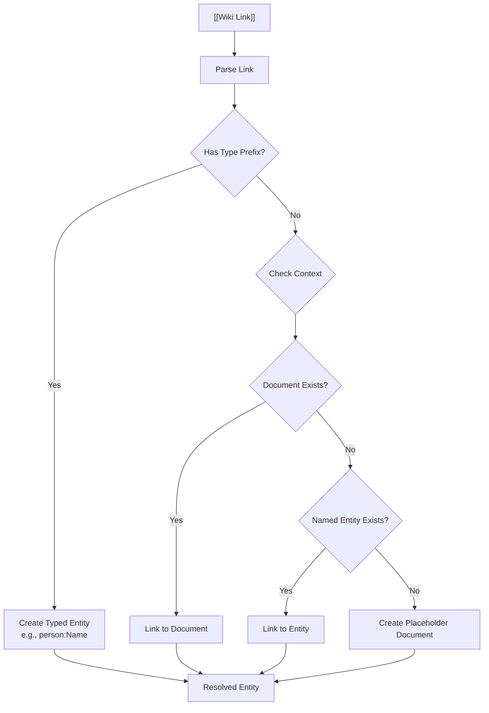
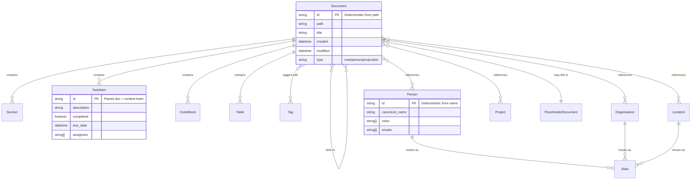
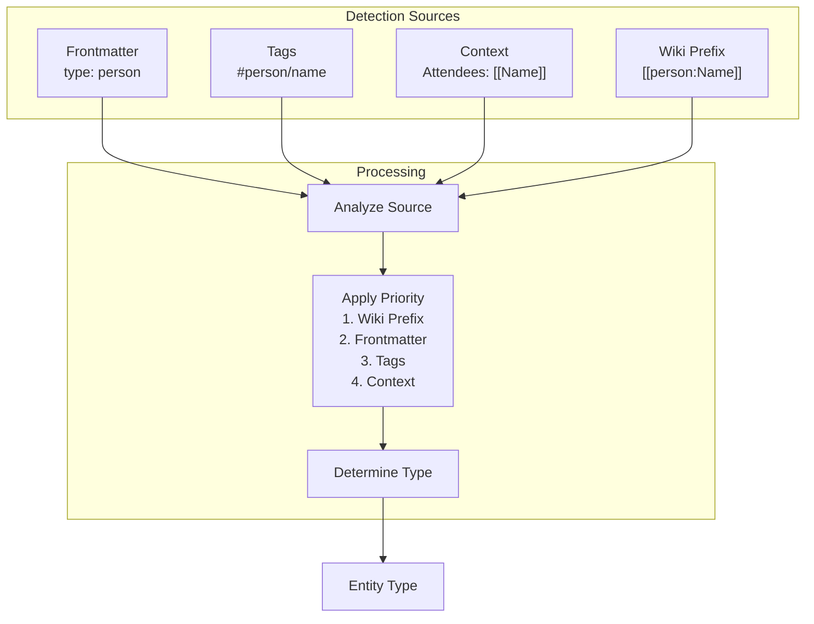
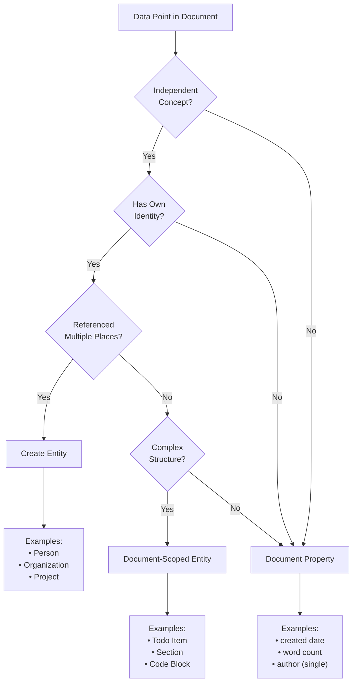
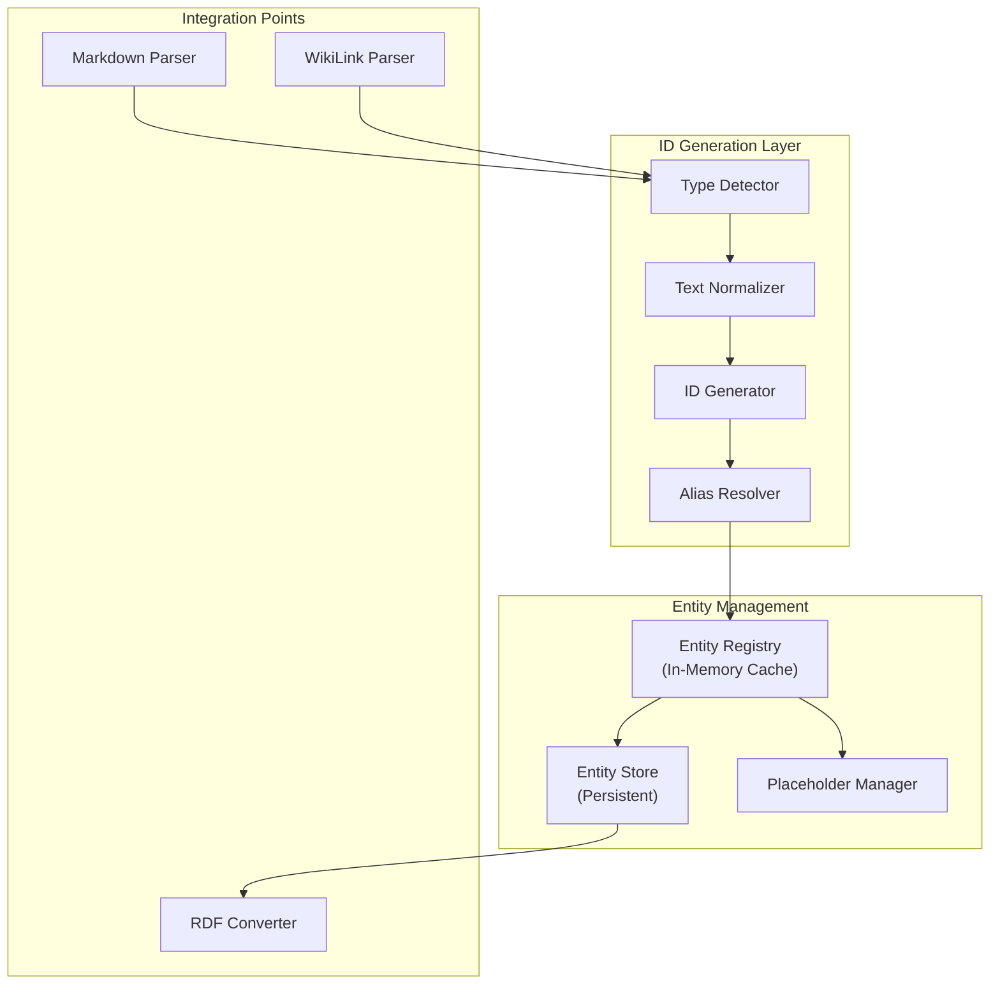

# Entity Hierarchy Architecture

## Overview

This document presents the architectural design for the new entity hierarchy that supports wiki-based knowledge graphs with deterministic entity ID generation.

## Entity Hierarchy Diagram

## Entity ID Generation Flow

## Wiki Link Resolution Process

## Data Model Relationships

## Entity Type Detection Pipeline

## Properties vs Entities Decision Tree

## Implementation Architecture

## Key Design Decisions

1. **Deterministic IDs**: All entity IDs are generated deterministically from their content
2. **Document-First**: Documents are the primary entities, everything else relates to them
3. **Wiki Compatibility**: Full support for wiki-style linking conventions
4. **Type Safety**: Clear entity type hierarchy with distinct ID patterns
5. **Placeholder Support**: Unresolved links create placeholder documents for future resolution
6. **Alias Management**: Entities can have multiple names that resolve to the same ID
7. **Scoped Entities**: Sub-document entities include parent document ID for uniqueness