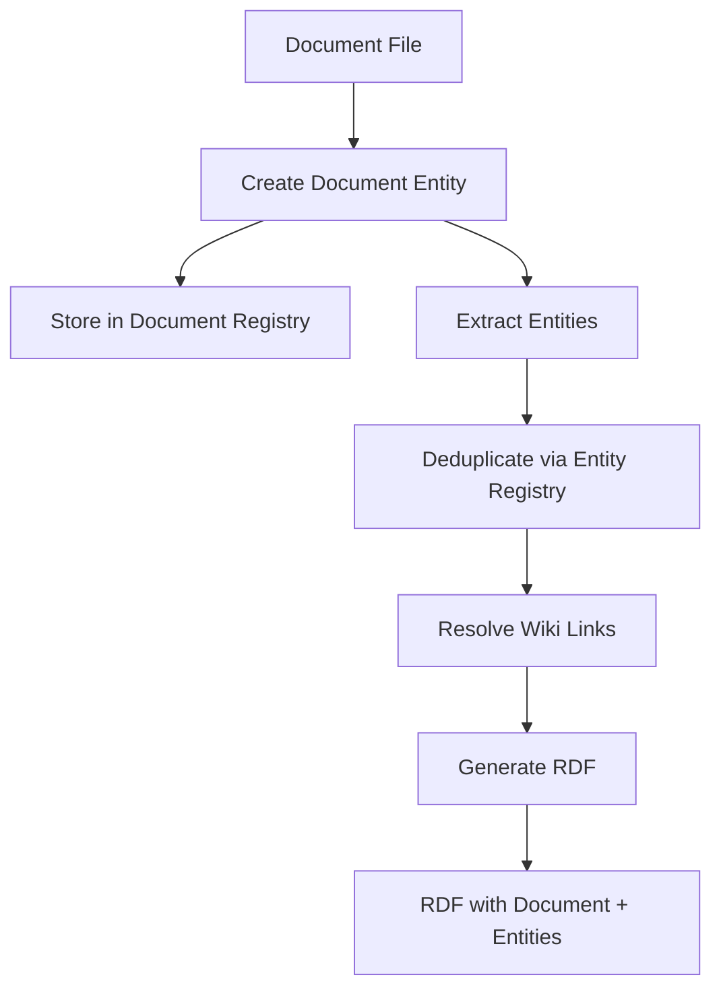

# Final Entity ID Architecture Summary

**Note:** This architecture summary has been formalized in [ADR-0012 (Entity Modeling with Wiki-Based Architecture)](../architecture/decisions/0012-entity-modeling-with-wiki-based-architecture.md) and [ADR-0013 (Wiki-Based Entity ID Generation and Link Preservation)](../architecture/decisions/0013-wiki-based-entity-id-generation-and-link-preservation.md). For implementation details, see the [Unified Entity ID Implementation Plan](unified-entity-id-implementation-plan.md).

## Overview

This document presents the complete architectural design for addressing entity duplication in the knowledge base, incorporating critical revisions for wiki link preservation and document entity creation.

## Core Issues Addressed

### 1. Entity Duplication (Original Issue)
- Same entities getting multiple IDs with random suffixes
- Example: "Galaxy Dynamics Co." appearing as multiple different entities

### 2. Wiki Link Breakage (Critical Discovery)
- Normalizing wiki link text would break file path resolution
- Wiki links must preserve original text exactly

### 3. Missing Document Entities (Critical Discovery)
- Documents themselves are not being created as entities
- Only entities WITHIN documents are being processed

## Final Design Solution

### 1. Deterministic Entity IDs

All entities receive deterministic IDs based on their type and properties:

| Entity Type | ID Pattern | Example |
|------------|------------|---------|
| Document | `/Document/{normalized-path}` | `/Document/daily-notes/2024-11-07-thursday` |
| Person | `/Person/{normalized-name}` | `/Person/alex-cipher` |
| Organization | `/Organization/{normalized-name}` | `/Organization/galaxy-dynamics` |
| Tag | `/Tag/{normalized-name}` | `/Tag/meeting-notes` |
| TodoItem | `/Document/{path}/TodoItem/{line}-{hash}` | `/Document/daily/TodoItem/15-a3f5b2c8d1` |

### 2. Document Dual-Path System

Documents maintain both normalized IDs and original paths:

```python
class KbDocument:
    kb_id: str                    # "/Document/daily-notes/2024-11-07-thursday"
    original_path: str            # "Daily Notes/2024-11-07 Thursday.md"
    path_without_extension: str   # "Daily Notes/2024-11-07 Thursday"
```

### 3. Wiki Link Resolution

Wiki links preserve original text and resolve through path matching:

```
[[Daily Note 2024-11-07 Thursday]]
  ↓
Try to find: "Daily Note 2024-11-07 Thursday.md"
  ↓
Return document with original_path match
  ↓
Link to: /Document/daily-note-2024-11-07-thursday
```

### 4. Document Entity Creation

Every processed document creates a document entity:

```turtle
<http://example.org/kb/Document/daily-notes/2024-11-07> a kb:Document ;
    rdfs:label "Daily Note 2024-11-07 Thursday" ;
    kb:originalPath "Daily Notes/2024-11-07 Thursday.md" ;
    kb:created "2024-11-07T08:54:54-05:00"^^xsd:dateTime ;
    kb:modified "2024-11-07T10:30:00-05:00"^^xsd:dateTime ;
    kb:hasEntity <http://example.org/kb/Person/alex-cipher> ;
    kb:hasEntity <http://example.org/kb/Organization/galaxy-dynamics> .
```

## Implementation Architecture

### Core Services

1. **ID Generator**
   - Generates normalized IDs for all entity types
   - Preserves original paths for documents

2. **Document Registry**
   - Maps original paths to document IDs
   - Enables wiki link resolution

3. **Entity Registry**
   - Deduplicates entities across documents
   - Manages aliases and variations

4. **Wiki Link Resolver**
   - Preserves original link text
   - Resolves to documents, entities, or placeholders

### Processing Flow



## Key Design Principles

1. **Documents First**: Documents are primary entities, not just containers
2. **Path Preservation**: Original file paths are sacred for wiki compatibility
3. **Deterministic IDs**: Same input always produces same ID
4. **Smart Deduplication**: Entities are unified across documents
5. **Backwards Compatible**: Existing wiki links continue to work

## Implementation Priorities

### Phase 1: Critical Fixes
1. Create document entities for all processed files
2. Preserve original paths in document model
3. Implement path-based wiki link resolution

### Phase 2: Core Improvements
1. Replace random UUID suffixes with deterministic IDs
2. Implement entity deduplication
3. Add document and entity registries

### Phase 3: Enhanced Features
1. Support typed wiki links (person:, org:, etc.)
2. Create placeholder documents for broken links
3. Add bidirectional entity-document relationships

## Success Metrics

1. **Zero Duplicate Entities**: Each real-world entity has one ID
2. **100% Wiki Link Resolution**: All existing wiki links work
3. **Complete Document Representation**: Every document appears in RDF
4. **Path Preservation**: Original file names are maintained
5. **Query Simplification**: Direct ID lookups replace text searches

## Migration Strategy

1. **Generate Document Entities**: Create for all existing processed files
2. **Populate Original Paths**: Extract from file system
3. **Map Old to New IDs**: Create translation table
4. **Update References**: Replace old IDs in existing data
5. **Verify Wiki Links**: Ensure all links resolve correctly

## Example: Complete Entity Set

For a document "Daily Notes/2024-11-07 Thursday.md" containing:
- Meeting with Alex Cipher from Galaxy Dynamics
- Todo items
- Tags: #meeting #planning

Generated entities:
```
/Document/daily-notes/2024-11-07-thursday (with originalPath preserved)
/Person/alex-cipher (deduplicated across all documents)
/Organization/galaxy-dynamics (deduplicated across all documents)
/Tag/meeting (global tag entity)
/Tag/planning (global tag entity)
/Document/daily-notes/2024-11-07-thursday/TodoItem/15-a3f5b2c8d1
```

## Related Decisions

- [ADR-0012: Entity Modeling with Wiki-Based Architecture](../architecture/decisions/0012-entity-modeling-with-wiki-based-architecture.md)
- [ADR-0013: Wiki-Based Entity ID Generation and Link Preservation](../architecture/decisions/0013-wiki-based-entity-id-generation-and-link-preservation.md)
- [ADR-0010: Entity Modeling and Transformation for RDF Serialization](../architecture/decisions/0010-entity-modeling-for-rdf-serialization.md) (Superseded)

## Implementation Guidance

For current implementation guidance, refer to:
- [Unified Entity ID Implementation Plan](unified-entity-id-implementation-plan.md) - Primary implementation guide
- [Test Cases ADR Alignment Analysis](test-cases-adr-alignment-analysis.md) - Test strategy and gaps
- [Planning Documents Consistency Analysis](planning-documents-consistency-analysis.md) - Document status overview

## Conclusion

This architecture solves three critical problems:
1. Eliminates entity duplication through deterministic IDs
2. Preserves wiki functionality through original path storage
3. Creates complete knowledge graphs by including document entities

The solution maintains backwards compatibility while providing a solid foundation for a true wiki-based knowledge graph.