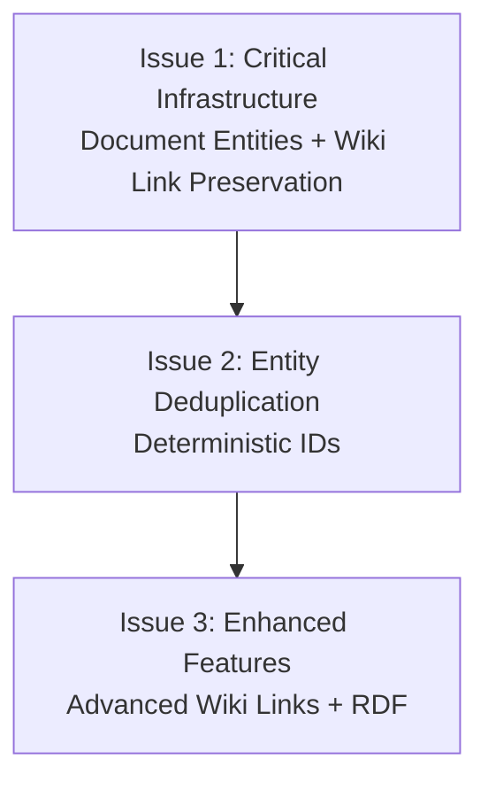

# GitHub Issue Structure Recommendation

**Date:** 2025-07-21  
**Purpose:** Organize implementation of ADR-0012/0013 entity ID architecture  
**Based on:** [Unified Entity ID Implementation Plan](unified-entity-id-implementation-plan.md)  

## Recommended Issue Structure

Based on the scope and critical dependencies, I recommend **3 focused GitHub issues** that align with the implementation phases:

### Issue 1: Critical Infrastructure - Document Entity Creation and Wiki Link Preservation
**Priority:** 🔴 Critical - Must be implemented first  
**Epic/Label:** `entity-architecture`  
**Estimated Effort:** 1-2 weeks  

**Title:** Implement Document Entity Creation and Wiki Link Text Preservation

**Description:**
This issue addresses the two most critical gaps identified in ADR-0012/0013:

1. **Document Entity Creation (Critical Bug Fix)**
   - Documents are not being created as entities in the knowledge graph
   - Every processed document must have a corresponding Document entity
   - Impacts: Missing fundamental nodes in the wiki graph

2. **Wiki Link Text Preservation (Critical Bug Fix)**  
   - Wiki link text must be preserved exactly for file system compatibility
   - Current normalization would break existing wiki links
   - Impacts: All wiki links would stop working

**Tasks:**
- [ ] Create `EntityIdGenerator` class with dual-path document ID generation
- [ ] Create `DocumentRegistry` service for path-based document lookups
- [ ] Update `KbDocument` model with dual-path fields (normalized_id, original_path, path_without_extension)
- [ ] Modify processor to always create document entities 
- [ ] Update wiki link extractor to preserve original text
- [ ] Create basic tests for document entity creation and wiki link preservation

**Success Criteria:**
- Every processed document creates a Document entity
- Wiki links preserve original text and resolve via path matching
- Document registry enables efficient wiki link resolution
- All existing wiki links continue to work

**Related Files:**
- `src/knowledgebase_processor/utils/id_generator.py` (new)
- `src/knowledgebase_processor/services/document_registry.py` (new)  
- `src/knowledgebase_processor/models/kb_entities.py` (update)
- `src/knowledgebase_processor/processor/processor.py` (update)
- `src/knowledgebase_processor/extractor/wikilink_extractor.py` (update)

**References:**
- [ADR-0013: Wiki-Based Entity ID Generation and Link Preservation](../architecture/decisions/0013-wiki-based-entity-id-generation-and-link-preservation.md)
- [Unified Implementation Plan - Phase 1](unified-entity-id-implementation-plan.md#phase-1-critical-infrastructure-week-1)

---

### Issue 2: Entity Deduplication and Deterministic IDs  
**Priority:** 🟡 High - Depends on Issue 1  
**Epic/Label:** `entity-architecture`  
**Estimated Effort:** 1-2 weeks  

**Title:** Replace Random Entity IDs with Deterministic IDs and Entity Deduplication

**Description:**
Implement the core entity deduplication system to eliminate duplicate entities across documents by replacing random UUID-based IDs with deterministic, content-based IDs.

**Current Problem:**
- Same entities get multiple random IDs (e.g., `/Organization/galaxy_dynamics_co_7a705a38`, `/Organization/galaxy_dynamics_co_b2c41f29`)
- No deduplication across documents
- Random suffixes prevent reliable entity references

**Solution:**
- Generate deterministic IDs based on entity type and normalized properties
- Global entity registry for deduplication
- Consistent IDs across all documents

**Tasks:**
- [ ] Complete `EntityIdGenerator` with all entity types (Person, Organization, Tag, etc.)
- [ ] Create `EntityRegistry` service for global entity deduplication
- [ ] Update `EntityService` to use deterministic ID generation (remove random UUIDs)
- [ ] Implement entity alias management and collision handling
- [ ] Add entity deduplication logic to processor
- [ ] Create comprehensive tests for entity deduplication scenarios

**Success Criteria:**
- Same entities have identical IDs across all documents
- No duplicate entities in the knowledge graph
- Entity IDs are predictable and human-readable
- Performance: <1ms per ID generation, <5ms with deduplication

**Dependencies:**
- Requires Issue 1 (Document entity creation and ID generator foundation)

**References:**
- [ADR-0013: Entity ID Patterns](../architecture/decisions/0013-wiki-based-entity-id-generation-and-link-preservation.md#id-patterns)
- [Unified Implementation Plan - Phase 2](unified-entity-id-implementation-plan.md#phase-2-core-entity-processing-week-2)

---

### Issue 3: Enhanced Wiki Link Resolution and RDF Integration
**Priority:** 🟢 Medium - Enhancement features  
**Epic/Label:** `entity-architecture`  
**Estimated Effort:** 1-2 weeks  

**Title:** Complete Wiki Link Resolution System and RDF Integration

**Description:**
Implement advanced wiki link features and complete RDF integration with bidirectional relationships.

**Features:**
1. **Advanced Wiki Link Resolution**
   - Typed wiki links (`[[person:Alex Cipher]]`, `[[org:Galaxy Dynamics]]`)
   - Context-based entity resolution
   - Placeholder document creation for broken links

2. **Complete RDF Integration**
   - Bidirectional document-entity relationships
   - Property vs entity classification
   - Enhanced RDF output with document metadata

**Tasks:**
- [ ] Enhance `WikiLinkResolver` with typed link support
- [ ] Implement context-based entity resolution
- [ ] Create `PlaceholderDocument` model and handling
- [ ] Update RDF converter for bidirectional relationships (hasEntity/mentionedIn)
- [ ] Implement property vs entity classification in frontmatter processing
- [ ] Add comprehensive integration tests
- [ ] Create migration tool for existing data

**Success Criteria:**
- Support for all wiki link patterns (typed, context-based, placeholders)
- Complete RDF representation with bidirectional relationships
- Clear property vs entity distinction
- Migration tool successfully updates existing data

**Dependencies:**
- Requires Issue 1 (Document registry and wiki link foundation)
- Requires Issue 2 (Entity deduplication and deterministic IDs)

**References:**
- [ADR-0013: Wiki Link Resolution Strategy](../architecture/decisions/0013-wiki-based-entity-id-generation-and-link-preservation.md#wiki-link-resolution-strategy)
- [Unified Implementation Plan - Phase 3-4](unified-entity-id-implementation-plan.md#phase-3-wiki-link-integration-week-3)

---

## Implementation Strategy

### Sequential Development
Issues must be implemented in order due to dependencies:

### Parallel Work Opportunities
Within each issue, some tasks can be parallelized:

**Issue 1 Parallelization:**
- Document model updates (KbDocument) can be done while building EntityIdGenerator
- DocumentRegistry can be developed alongside wiki link extractor updates

**Issue 2 Parallelization:**
- EntityRegistry development can happen while updating EntityService
- Test development can proceed alongside implementation

### Testing Strategy
Each issue should include comprehensive tests:
- **Issue 1:** Document entity creation, wiki link preservation, dual-path model
- **Issue 2:** Entity deduplication, deterministic ID generation, performance
- **Issue 3:** Advanced wiki resolution, RDF integration, migration

## Alternative: Single Large Issue
**Not Recommended** - A single issue would be too large (~4-6 weeks) and harder to:
- Review thoroughly  
- Test incrementally
- Roll back if problems arise
- Assign to multiple developers

## Success Metrics

### Issue 1 Success
- [ ] 100% of documents create Document entities
- [ ] All existing wiki links resolve correctly
- [ ] No normalization of wiki link text during resolution

### Issue 2 Success  
- [ ] Zero duplicate entities across documents
- [ ] All entity IDs are deterministic and predictable
- [ ] Performance targets met (<1ms ID generation)

### Issue 3 Success
- [ ] Support for all wiki link patterns
- [ ] Complete RDF representation with relationships
- [ ] Successful migration of existing data

## Risk Mitigation

### Issue Dependencies
- Each issue provides value independently
- Clear acceptance criteria prevent scope creep
- Sequential implementation reduces integration risk

### Rollback Strategy
- Each issue can be rolled back independently
- Feature flags can control new vs old behavior during transition
- Comprehensive test coverage prevents regressions

---

**Recommendation:** Proceed with the 3-issue structure for optimal balance of scope, reviewability, and risk management.