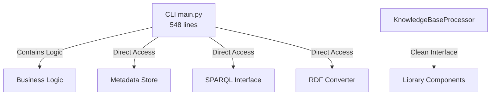
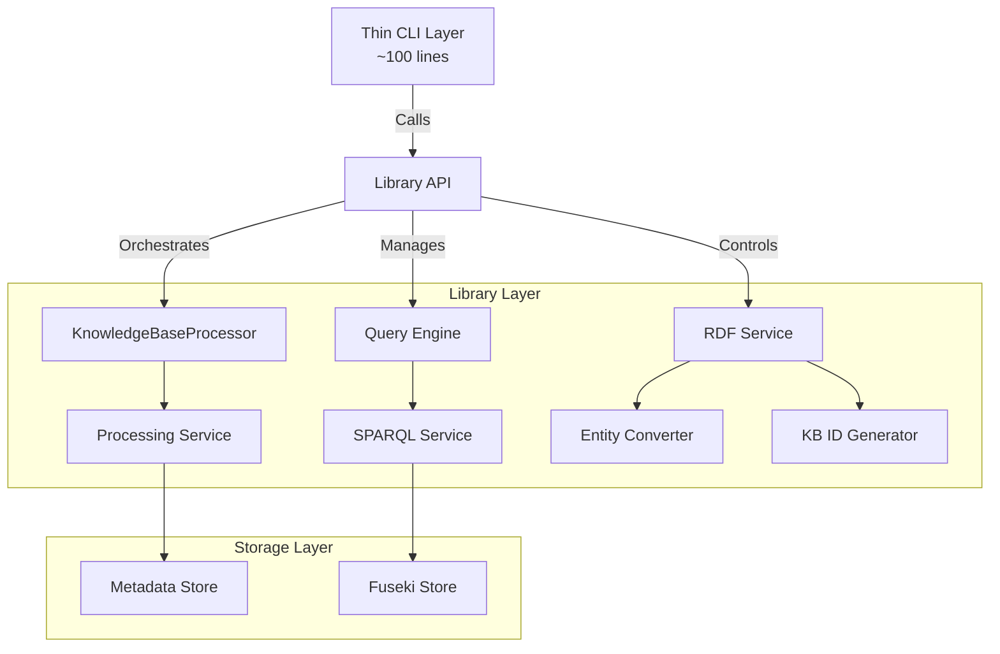

# Implementation Plan: Refactor CLI into Simple Shell over Library
## GitHub Issue #44

### Executive Summary

This plan outlines the refactoring of the Knowledge Base Processor CLI to transform it from a monolithic command-line interface into a thin shell layer over a well-structured library. The goal is to move all business logic into the library layer, making the CLI purely responsible for argument parsing and result presentation.

### Current State Analysis

#### Problem Statement
The current CLI implementation (`src/knowledgebase_processor/cli/main.py`) contains significant business logic:
- Entity transformation logic (`_extracted_entity_to_kb_entity`)
- KB ID generation (`_generate_kb_id`)
- Direct SPARQL query execution
- RDF processing logic
- Complex command routing and execution

This violates the separation of concerns principle and makes the code difficult to test and maintain.

#### Current Architecture


### Target Architecture

#### Design Principles
1. **Thin CLI Layer**: CLI should only handle argument parsing and output formatting
2. **Rich Library API**: All business logic moves to the library layer
3. **Testable Components**: Each component should be independently testable
4. **Clear Boundaries**: Well-defined interfaces between layers

#### Proposed Architecture


### Implementation Plan

#### Phase 1: Extract Business Logic to Library Services

##### 1.1 Create Entity Service (`src/knowledgebase_processor/services/entity_service.py`)
```python
class EntityService:
    """Handles entity transformation and KB ID generation."""
    
    def generate_kb_id(self, entity_type: str, text: str) -> str:
        """Generates a unique knowledge base ID for an entity."""
        
    def transform_to_kb_entity(self, 
                               extracted_entity: ExtractedEntity,
                               source_doc_path: str) -> Optional[KbBaseEntity]:
        """Transforms an ExtractedEntity to a KbBaseEntity."""
```

##### 1.2 Create SPARQL Service (`src/knowledgebase_processor/services/sparql_service.py`)
```python
class SparqlService:
    """High-level SPARQL operations service."""
    
    def execute_query(self, query: str, format: str = "json") -> Any:
        """Execute a SPARQL query and return formatted results."""
        
    def load_rdf_file(self, file_path: Path, graph_uri: Optional[str] = None) -> None:
        """Load an RDF file into the SPARQL store."""
```

##### 1.3 Create Processing Service (`src/knowledgebase_processor/services/processing_service.py`)
```python
class ProcessingService:
    """Orchestrates document processing operations."""
    
    def process_documents(self, pattern: str, rdf_output_dir: Optional[Path] = None) -> ProcessingResult:
        """Process documents matching pattern with optional RDF generation."""
        
    def process_single_document(self, file_path: Path) -> Document:
        """Process a single document."""
```

#### Phase 2: Create Unified Library API

##### 2.1 Extend KnowledgeBaseProcessor API (`src/knowledgebase_processor/api.py`)
```python
class KnowledgeBaseAPI:
    """Unified API for all knowledge base operations."""
    
    def __init__(self, config: Config):
        self.processor = KnowledgeBaseProcessor(...)
        self.entity_service = EntityService()
        self.sparql_service = SparqlService(config)
        self.processing_service = ProcessingService(self.processor)
    
    def process(self, pattern: str, **kwargs) -> ProcessingResult:
        """Process documents with given pattern."""
        
    def query(self, query: str, query_type: str = "text") -> QueryResult:
        """Execute a query against the knowledge base."""
        
    def sparql_query(self, query: str, **kwargs) -> SparqlResult:
        """Execute a SPARQL query."""
        
    def sparql_load(self, file_path: Path, **kwargs) -> None:
        """Load RDF file into SPARQL store."""
```

#### Phase 3: Refactor CLI to Thin Shell

##### 3.1 New CLI Structure (`src/knowledgebase_processor/cli/main.py`)
```python
def main(args: Optional[List[str]] = None) -> int:
    """Thin CLI wrapper around library API."""
    parsed_args = parse_args(args)
    
    # Initialize API with config
    api = KnowledgeBaseAPI(load_config(parsed_args.config))
    
    # Route to appropriate handler
    handlers = {
        'process': handle_process,
        'query': handle_query,
        'sparql': handle_sparql
    }
    
    handler = handlers.get(parsed_args.command)
    if handler:
        return handler(api, parsed_args)
    
    return 1

def handle_process(api: KnowledgeBaseAPI, args: Namespace) -> int:
    """Handle process command - just parse args and call API."""
    try:
        result = api.process(
            pattern=args.pattern,
            rdf_output_dir=args.rdf_output_dir
        )
        print_process_result(result)
        return 0
    except Exception as e:
        print(f"Error: {e}", file=sys.stderr)
        return 1
```

### Testing Strategy

#### Unit Tests Structure
```
tests/
├── unit/
│   ├── services/
│   │   ├── test_entity_service.py
│   │   ├── test_sparql_service.py
│   │   └── test_processing_service.py
│   └── api/
│       └── test_knowledge_base_api.py
├── integration/
│   ├── test_cli_integration.py
│   ├── test_sparql_integration.py
│   └── test_e2e_fuseki.py
└── e2e/
    └── test_markdown_to_fuseki.py
```

#### Integration Test Improvements

##### Enhanced CLI Integration Tests
```python
class TestCLIIntegration(unittest.TestCase):
    """Test CLI commands through subprocess calls."""
    
    def test_process_command(self):
        """Test the process command executes correctly."""
        result = subprocess.run([
            'python', '-m', 'knowledgebase_processor.cli',
            'process', '--pattern', '*.md'
        ], capture_output=True)
        self.assertEqual(result.returncode, 0)
    
    def test_sparql_query_command(self):
        """Test SPARQL query execution through CLI."""
        # Test with mock SPARQL endpoint
```

##### E2E Test for Markdown to Fuseki
```python
class TestMarkdownToFuseki(unittest.TestCase):
    """End-to-end test: Markdown processing to Fuseki storage."""
    
    def test_complete_pipeline(self):
        """Test complete pipeline from markdown to queryable RDF."""
        # 1. Process markdown files
        # 2. Generate RDF
        # 3. Load into Fuseki
        # 4. Query the data
        # 5. Verify results
```

### Implementation Steps

#### Step 1: Create Service Layer (Week 1)
- [ ] Implement EntityService with tests
- [ ] Implement SparqlService with tests
- [ ] Implement ProcessingService with tests

#### Step 2: Create Unified API (Week 2)
- [ ] Design and implement KnowledgeBaseAPI
- [ ] Add comprehensive API tests
- [ ] Update existing integrations to use new API

#### Step 3: Refactor CLI (Week 3)
- [ ] Remove business logic from CLI
- [ ] Implement thin command handlers
- [ ] Update CLI tests to focus on argument parsing

#### Step 4: Enhanced Testing (Week 4)
- [ ] Implement integration test suite
- [ ] Create E2E test with Fuseki
- [ ] Add performance benchmarks
- [ ] Documentation updates

### User Stories

#### Story 1: As a Developer, I want a clean library API
**Acceptance Criteria:**
- Can import and use KnowledgeBaseAPI without CLI
- All business logic accessible through API methods
- Clear documentation and type hints

#### Story 2: As a CLI User, I want consistent command behavior
**Acceptance Criteria:**
- All existing CLI commands work identically
- Better error messages and validation
- Improved help documentation

#### Story 3: As a Test Engineer, I want comprehensive test coverage
**Acceptance Criteria:**
- Unit tests for all service classes
- Integration tests for CLI commands
- E2E test demonstrating full pipeline

#### Story 4: As a DevOps Engineer, I want reliable deployment
**Acceptance Criteria:**
- CLI can be installed and run independently
- Clear dependency management
- Docker-based test environment

### Migration Guide

#### For CLI Users
- No changes to command syntax
- Improved error messages
- Faster execution due to optimized code paths

#### For Library Users
```python
# Old way (not recommended)
from knowledgebase_processor.cli.main import _generate_kb_id
kb_id = _generate_kb_id("Person", "John Doe")

# New way
from knowledgebase_processor import KnowledgeBaseAPI
api = KnowledgeBaseAPI(config)
result = api.process("*.md", rdf_output_dir="output/")
```

### Success Metrics

1. **Code Quality**
   - CLI reduced from 548 to ~100 lines
   - 100% test coverage for service layer
   - All business logic in library layer

2. **Performance**
   - No regression in processing speed
   - Improved startup time for CLI
   - Reduced memory footprint

3. **Maintainability**
   - Clear separation of concerns
   - Easy to add new commands
   - Simple to test individual components

### Risk Mitigation

1. **Breaking Changes**: Maintain backward compatibility for all CLI commands
2. **Performance Impact**: Benchmark before and after refactoring
3. **Test Coverage**: Ensure no reduction in test coverage during refactor

### Conclusion

This refactoring will transform the Knowledge Base Processor from a monolithic CLI application into a well-structured library with a thin CLI shell. This architecture will improve testability, maintainability, and reusability while preserving all existing functionality.