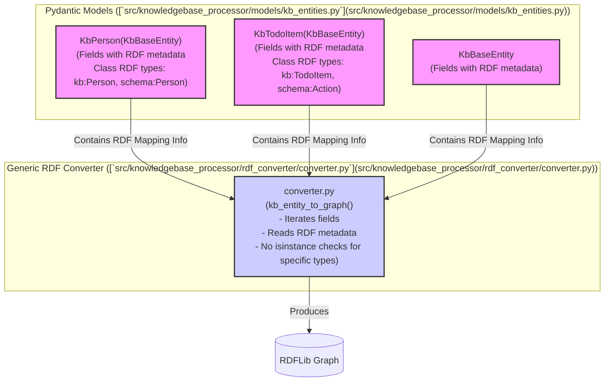

# Proposed Review Content for Pull Request #30

**Overall Assessment:**
The pull request successfully introduces the `KbPerson` and `KbTodoItem` Pydantic models ([`src/knowledgebase_processor/models/kb_entities.py`](src/knowledgebase_processor/models/kb_entities.py)) and their initial RDF serialization logic ([`src/knowledgebase_processor/rdf_converter/converter.py`](src/knowledgebase_processor/rdf_converter/converter.py:14)). This addresses the core requirements of issue #29. The accompanying unit tests in [`tests/models/test_kb_entities.py`](tests/models/test_kb_entities.py) and [`tests/rdf_converter/test_converter.py`](tests/rdf_converter/test_converter.py) are comprehensive for the current implementation.

**Addressing Existing Review Feedback:**
The comment from @dstengle regarding the RDF serialization strategy in [`src/knowledgebase_processor/rdf_converter/converter.py`](src/knowledgebase_processor/rdf_converter/converter.py:14) highlights an important area for architectural improvement. The current approach, which relies on `isinstance` checks (e.g., [`converter.py L55`](src/knowledgebase_processor/rdf_converter/converter.py:55), [`L77`](src/knowledgebase_processor/rdf_converter/converter.py:77)), could lead to maintainability challenges as more entity types are introduced.

**Recommended Refactoring Plan (to address the feedback):**
To enhance the design, the following refactoring is suggested. This plan aims to make the RDF conversion process more generic and metadata-driven, as per the feedback.

1.  **Embed RDF Mapping Metadata in Pydantic Models:**
    *   **Location:** [`src/knowledgebase_processor/models/kb_entities.py`](src/knowledgebase_processor/models/kb_entities.py)
    *   **Mechanism:** Utilize Pydantic's `Field` `json_schema_extra` parameter (or a more structured custom model if needed via `FieldInfo.metadata` in Pydantic v2, or a dedicated config class) to associate RDF mapping details directly with each model field.
    *   **Metadata to include:**
        *   `rdf_property: URIRef` (e.g., `SCHEMA.name`, `KB.isCompleted`).
        *   `rdf_properties: List[URIRef]` (for fields mapping to multiple RDF properties).
        *   `rdf_datatype: Optional[URIRef]` (e.g., `XSD.string`, `XSD.dateTime`) for literal values.
        *   `is_object_property: bool` (to differentiate data literals from relations to other entities).
        *   `rdfs_label_fallback: bool` (to indicate if a field's value can serve as `rdfs:label` if no explicit label is provided).
    *   **Class-level RDF Type:** Define the primary `rdf:type`(s) for each model (e.g., `KB.Person`, `SCHEMA.Person`) possibly in the model's `Config` or a class variable.

    *Illustrative Example for `KbPerson` field:*
    ```python
    # In src/knowledgebase_processor/models/kb_entities.py
    from rdflib.namespace import SCHEMA, RDFS, XSD # Ensure KB is also available
    from pydantic import Field

    class KbPerson(KbBaseEntity):
        # ...
        full_name: Optional[str] = Field(
            default=None,
            json_schema_extra={
                "rdf_properties": [SCHEMA.name, KB.fullName], # Maps to schema:name and kb:fullName
                "rdfs_label_fallback": True
            }
        )
        email: Optional[str] = Field(
            default=None,
            json_schema_extra={"rdf_properties": [SCHEMA.email]}
        )
        # ... other fields

        class Config:
            json_schema_extra = { # Or a dedicated attribute
                "rdf_types": [KB.Person, SCHEMA.Person]
            }
    ```

2.  **Generalize `RdfConverter`:**
    *   **Location:** [`src/knowledgebase_processor/rdf_converter/converter.py`](src/knowledgebase_processor/rdf_converter/converter.py:14)
    *   **Logic:**
        *   Modify the [`kb_entity_to_graph`](src/knowledgebase_processor/rdf_converter/converter.py:19) method.
        *   Remove explicit `isinstance` blocks for `KbPerson` and `KbTodoItem`.
        *   The converter should iterate over the Pydantic model's fields (`model_fields`).
        *   For each field, extract the RDF mapping metadata defined in step 1.
        *   Dynamically construct RDF triples based on this metadata.
        *   Use the class-level `rdf_types` metadata to add `rdf:type` statements.
        *   Common fields from `KbBaseEntity` can also have metadata or be handled by a base iteration logic.

3.  **Update Unit Tests:**
    *   **Location:** [`tests/rdf_converter/test_converter.py`](tests/rdf_converter/test_converter.py)
    *   **Adjustments:** While the expected RDF graph outputs should largely remain consistent, the tests will now verify the behavior of the new generic, metadata-driven conversion logic.

**Diagram of Proposed Refactoring:**


**Recommendation for PR #30:**
*   **Acknowledge:** The PR author should acknowledge this architectural feedback.
*   **Action:**
    *   **Option A (Ideal for this PR):** Implement the suggested refactoring within this pull request. This would make the initial introduction of these models and their RDF capabilities more robust.
    *   **Option B (Alternative):** If the refactoring is deemed too extensive for the current scope, merge the PR as is (given it adds functional value) and immediately create a high-priority follow-up technical debt issue to implement this refactoring.

This refactoring will establish a more scalable and maintainable pattern for RDF serialization as the knowledge base model evolves.